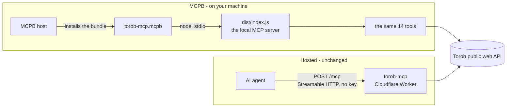
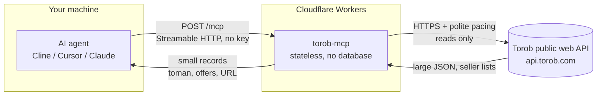

# Torob MCP - Price comparison intelligence for AI agents


A public MCP server that gives AI agents **real Torob knowledge**: search **Iran's price-comparison engine**, **prices in Toman**, **every seller's offer on one product**, **price history and trends**, **shop profiles**, in-person sellers, shop grades and cities, delivery options, Torob's own filters, category tree, provinces and cities, and the deals it is featuring right now. **Read-only, no key needed. No login, ever.**

**Live endpoint:** `https://torob-mcp.mmdju3.workers.dev/mcp` (Streamable HTTP, stateless) - opening the bare address in a browser shows [the site](https://torob-mcp.mmdju3.workers.dev/), and `GET /mcp` gets the connect page instead of a JSON error.

**[نسخه فارسی](README_FA.md)** · **[Examples](examples/sample-calls.md)** · **[Tool reference](docs/tools.md)** · **[Changelog](CHANGELOG.md)**

## Connect in 30 seconds

Any MCP client, **one URL**. Cline / Cursor / Claude Desktop (`mcp.json` style):

```json
{
  "mcpServers": {
    "torob": { "url": "https://torob-mcp.mmdju3.workers.dev/mcp" }
  }
}
```

Then just talk: **"ارزون‌ترین آیفون ۱۳ کجاست؟"**, **"هدفون زیر ۱۰ میلیون"**, **"این گوشی رو کجا بخرم بهتره؟"**, **"چی تخفیف خورده؟"**.

Agents running in a browser work too - the endpoint answers CORS preflights (`OPTIONS /mcp`).

### Or run it on your own machine

The same fourteen tools as a **local process** - no endpoint of ours, no rate limit of ours. What a run learns goes in `~/.torob-mcp/state.json`: the product names and links it found, and the wall it is waiting out. A restart keeps both; deleting that file starts you over.

One line - the first run is slower because npm builds it, and `git` must be installed, since one dependency (`fa-text-utils`) is fetched from a git repository:

```json
{
  "mcpServers": {
    "torob": { "command": "npx", "args": ["-y", "github:mmdju/torob-mcp"] }
  }
}
```

Or from a clone, if you would rather run code you can read:

```bash
git clone https://github.com/mmdju/torob-mcp.git
cd torob-mcp && npm install      # the prepare script builds dist/
```

```json
{
  "mcpServers": {
    "torob": { "command": "node", "args": ["/path/to/torob-mcp/dist/index.js"] }
  }
}
```

### Or install it as an MCPB bundle

The same local server as **one file**, in the package format an MCPB host installs. Build it with `npm run build:mcpb`, then point your host at `build/torob-mcp.mcpb` - **[the MCPB bundle, in full](#the-mcpb-bundle)**.

## 14 tools

| Tool | What it answers | Needs |
|---|---|---|
| `torob_suggest` | Vague wording to **the search terms Torob itself suggests** | `query` |
| `search_products` | "Show me X", price checks - **filters, sorting, paging, price window**, plus every filter that search accepts | `query`; `city` is a `list_locations` id |
| `product_details` | One product plus **every seller's offer** - online and **in person** - with the spec tables and the full price window | `prk`, or the `details_url` from the search card |
| `price_history` | "Is now a good time to buy?" - Torob's **own price chart**, month by month, and when it last moved | `prk` |
| `similar_products` | "That one is too expensive, what else?" | `prk` |
| `compare_products` | "Which of these?" - **only what actually differs**, plus the price spread | `prks`: 2-5 products |
| `find_best_value` | "Best X under Y Toman" - **ranked by what your budget actually reaches** | `query`; `budget_toman` optional |
| `shop_profile` | "Is this seller any good?" - **Torob's own notes**, seal, score, delivery terms, and the shop's catalogue | `shop_id` - the numeric id from any offer |
| `find_shops` | Find a **shop** by name or city, when the user names a store rather than a product | `query` and/or `city`, both optional |
| `search_by_image` | "What is this?" - products matched to a **picture link**, no upload | `image_url`: a public http(s) link |
| `torob_trends` | **What shoppers are searching right now**, each with a sample product | nothing |
| `browse_categories` | Walk Torob's **category tree**, with each category's product count | `id`; `1` is the top level |
| `list_locations` | **Province and city ids**, plus the cities shoppers pick most | `province_id` optional; omit for the province list |
| `special_offers` | **Today's featured deals**, kept separate from any product's seller list | nothing |

Every tool is read-only (`readOnlyHint: true`) and needs no credentials. Nothing here can order, message or contact a shop. `prk` and `shop_id` only mean something this server has already handed out - a Torob product id is not an address upstream, which is what [docs/architecture.md](docs/architecture.md) is for. Every parameter, filter slug and response field is in [docs/tools.md](docs/tools.md).

Notes for agent builders:

- **All prices are in Toman** (1 Toman = 10 Rial). Prices, stock and shop grades **move constantly** - always link the product URL so the user can confirm before buying.
- **A search card is one price - the cheapest offer.** `product_details` is the call that lists every seller, and the `price_spread_toman` between them is the whole reason a price-comparison source exists. It also returns the shops that sell the product **in person** (`in_person_sellers`), with each shelf price's `last_price_change_date` - a shop price can be months old, so say how old it is.
- **`price_history` is the honesty check on a price.** Compare today's cheapest offer with what Torob charts for the product; the series labels are Torob's own, so quote them rather than inventing a trend.
- **`price_toman: null` means not available** - out of stock upstream, or no price at all. It is never 0, and **0 is never free**: Torob's own "not for sale" comes back as `available: false`.
- **`price_unreliable: true` is Torob saying that price cannot be trusted.** Pass the warning on; do not present it as a bargain.
- **A shop grade needs its vote count.** Torob sends a score for nearly every offer but almost never the votes behind it, so `shop_score: 5` with `shop_votes: 0` is normal and means "no votes yet", not "five-star shop".
- **An empty result is not proof a product does not exist.** The response carries `query_note` plus Torob's own `suggested_queries` - retry with one of them instead of telling the user it is unavailable.
- **An unknown filter slug or value is refused with the real ones.** `available_filters` carries each group's accepted values (`options`, plus `values_url` for the full brand list); Torob ignores a slug or value it does not know and answers **unfiltered**, so a typo used to hand back a full unfiltered list that read as a filtered answer.
- **Torob answers a client that calls too fast with a bot challenge instead of data.** The server reports it plainly, never solves or evades it, and holds the rest of a burst for the whole cooldown rather than retrying into a longer block. Details in [SECURITY.md](SECURITY.md).
- Results are **capped** (default 10, and each tool's own maximum - 24 on a product search, 30 on most lists - is in [docs/tools.md](docs/tools.md)) to protect agent context. Persian wording is folded (Arabic yeh/kaf, Persian and Arabic-Indic digits, ZWNJ kept) when cache keys and product names are compared - the query itself reaches Torob exactly as typed, and Torob folds it the same way.
- **[examples/sample-calls.md](examples/sample-calls.md)** has eleven copy-paste flows, and **[docs/tools.md](docs/tools.md)** has every parameter and filter slug. Response types live in **[docs/card.d.ts](docs/card.d.ts)**.

## The MCPB bundle

The local server as **one file**. **MCP** is the protocol an agent and a server speak. **MCPB** is the package that server arrives in - the single file a host installs to get a local MCP server with no build step, no `git`, and no `node_modules` of its own to assemble. The format and the extension were both renamed from DXT; this repository ships `.mcpb`.

### Two ways to reach the same fourteen tools

MCPB is the **local** route. It does not replace the hosted deployment, and nothing below changes it.



- **Remote** - one URL, no install, shared infrastructure, and the 20 calls/minute limit described under [Status](#status).
- **MCPB** - no endpoint of ours in the loop and no limit of ours. Torob's own pacing and bot wall still apply, because the calls are still Torob's.

### Build and install

```bash
git clone https://github.com/mmdju/torob-mcp.git
cd torob-mcp
npm ci               # or npm install - the prepare script builds dist/
npm run build:mcpb   # -> build/torob-mcp.mcpb
```

`build/torob-mcp.mcpb` is the artifact. A host that speaks MCPB installs it through its own bundle import - point it at that file - and then runs it as the manifest says. There is no registry entry, no update channel and no prebuilt file published from this repository: **you build it**, so what you install is the code in the clone you can read.

To look inside before installing anything:

```bash
npx mcpb info build/torob-mcp.mcpb
# File: torob-mcp.mcpb
# Size: 4031.82 KB
# WARNING: Not signed
```

It is **not signed**, and nothing here pretends otherwise: the build does not sign, `mcpb sign` needs a key this project does not have, and a host that requires a signature will refuse the bundle.

### What the build actually does

`npm run build:mcpb` runs `tsc` and then `node scripts/build-mcpb.mjs`. The script:

1. **Stages `build/mcpb/` from scratch**, so a file deleted from the source cannot survive in a bundle.
2. **Walks the entry point's imports.** It starts at `dist/index.js` and follows static relative imports, copying each module it reaches - eleven of them. `dist/` holds both builds, the Node one and the Worker one, so this walk is what keeps `worker.js`, `rate-limit.js`, `og-image.js` and `fonts.js` out; an import that cannot be resolved is a build failure, not a broken bundle in somebody's host.
3. **Copies the production dependency tree** out of the `node_modules` npm already produced, using npm's own answer to "what does this package need at runtime" (`npm ls --omit=dev`) and skipping what npm reports as `extraneous`. The bundle runs `node` outside any install, so it has to carry them.
4. **Writes two files of its own**: a minimal `package.json` - `"type": "module"` is not optional, since `dist/*.js` are ES modules and Node would otherwise read the entry as CommonJS and fail on its first import - and the manifest with its `version` taken from `package.json`. `.mcpbignore` travels with the staging folder.
5. **Hands the folder to the official CLI.** `@anthropic-ai/mcpb` is pinned to an exact version as a devDependency and resolved out of `node_modules`, so the artifact never depends on what a machine happens to have installed globally. The CLI validates (`mcpb validate`) and packs (`mcpb pack`).
6. **Reads the archive back.** It unpacks what it just wrote (`mcpb unpack`) and then checks that every required file is there - `manifest.json`, `package.json`, the entry, `dist/server.js`, `dist/tools.js`, `dist/project.js`, and both runtime dependencies - that the manifest's version equals `package.json`'s, and that nothing forbidden came along: `.env*`, `.dev.vars`, `.git`, `node_modules/.bin`, `tsconfig.json`, `package-lock.json`, `*.pem`, `*.key`, `*.mcpb`, `*.tgz`, `*.log`, `*.map`, or one of the Worker-only modules. Any of those fails the build rather than shipping.

It needs a `node_modules` that already exists. It installs nothing itself, uses no network, and calls no git. Result: about 12MB unpacked, under 4MB packed, nearly all of it the MCP SDK and its dependencies. `build/` is gitignored - the bundle is an artifact, not a source file.

### What is in the bundle

```text
build/torob-mcp.mcpb
├── manifest.json        name, version, description, compatibility, the 14 tool names
├── package.json         minimal: type: module, plus the runtime dependency list
├── dist/                the eleven modules dist/index.js imports
│   ├── index.js         the local entry point - stdio by default, --http optional
│   ├── server.js        buildServer() - the code the Worker runs too
│   ├── tools.js         the fourteen tools
│   ├── project.js       the projection layer
│   └── …
└── node_modules/        the production dependency tree (95 packages)
```

Deliberately absent: `src/`, `tests/`, `scripts/`, `docs/`, `landing/`, `assets/`, `.github/`, `.wrangler/`, the Worker build, `.env*`, keys, certificates, lockfiles and `node_modules/.bin`. On top of that the CLI drops `.git`, `*.d.ts` and source maps itself, and `.mcpbignore` is a second line of defence - written out even though the staging list already excludes those paths, so that a change to the staging code cannot ship a secret by accident and so that `mcpb pack .` in a clone is safe too.

### It is the same server, not a second one

This is the decision worth knowing: **the bundle contains no second implementation of anything.** It launches `dist/index.js` - the entry point `node dist/index.js` has always launched - over stdio, with `${__dirname}` resolved to wherever the host unpacked it.

```text
                MCPB
                  │
                  ▼
        ${__dirname}/dist/index.js
                  │
                  ▼
       buildServer()  ← src/server.ts, shared with the Worker
                  │
          ┌───────┴───────┐
          ▼               ▼
    the 14 tools     Torob public web API
```

So the tools, the projection layer, the Torob integration, the pacing and the bot-wall gate are all the same code in every deployment. Local, MCPB and hosted cannot drift apart, because there is only one copy of the logic - and a fix for a tool is a fix everywhere, with no bundle to rebuild by hand.

The manifest's `server` block is the whole of it:

```json
{
  "type": "node",
  "entry_point": "dist/index.js",
  "mcp_config": { "command": "node", "args": ["${__dirname}/dist/index.js"] }
}
```

### Configuration: there is none

The manifest declares **no `user_config`**, and an MCPB host will not prompt you for anything. That is the correct state, not an omission: Torob needs no key, this server never signs in, and a prompt would be asking for a credential that has no use. The manifest also carries no `env` block, no `platform_overrides`, and no secrets.

Two environment variables remain optional, and both already existed for a local run - they belong to the host's environment, not to the bundle:

| Variable | Default | What it does |
|---|---|---|
| `TOROB_MCP_HOME` | `~/.torob-mcp` | Where the local store keeps `state.json` |
| `TOROB_MCP_STORE=off` | store on | Turns the store off |

The store holds two things: a product's name and details URL, and the marker saying Torob's wall is still up. Deleting the file resets the server completely.

### Verify it

```bash
npm test                        # the suite, including the MCPB manifest gates
npm run typecheck               # tsc --noEmit
npm run build:mcpb              # build, pack, then re-read the archive
node scripts/verify-mcpb.mjs    # launch the packed bundle for real
```

- **`npm test`** runs `tests/mcpb.test.mjs` next to everything else: the manifest is validated against the schema the pinned CLI ships - not a copy of it - its version is held to `package.json`, its entry point and `mcp_config` are checked against the file the local server actually launches, its declared tool names must equal `TOOLS`, and no `user_config`, `env` block, absolute path or developer-machine path is allowed in it.
- **`npm run build:mcpb`** also runs on every push in CI ([](https://github.com/mmdju/torob-mcp/actions/workflows/test.yml)), since the suite above checks the manifest and only the build checks the artifact.
- **`node scripts/verify-mcpb.mjs`** is the one that proves the artifact *runs*. It unpacks the bundle into an empty directory outside the repository, launches it exactly as `mcp_config` says, completes an `initialize` handshake, checks the version the server reports against the manifest, lists the tools and compares them with the declared names, then makes one real read-only call - `torob_suggest`, the cheapest one there is - against Torob. A bot challenge is reported as the finding it is instead of failing the run. It needs the network, so it is run by hand.

### Security notes for the bundle

- **It runs as you.** A host launches a real `node` process; whatever the server does, it does with your permissions and your network access. A bundle is a distribution format, not a sandbox.
- **It carries no credentials**, because there are none to carry - no key, no account, no token, and no `.env` for a host to fill in. If this server ever needed one, the honest place for it would be an MCPB `user_config` prompt, not a file in the archive.
- **The build refuses to ship a secret.** The staging list is built from the import graph and npm's own production tree, never from "everything except a deny-list", and the packed archive is read back for `.env*`, `.dev.vars`, keys, certificates and repository metadata before the build is allowed to pass.
- **It is the same read-only server.** All 14 tools keep `readOnlyHint`; nothing can order, message or contact a shop. Torob's bot wall is still reported rather than solved, and the 20/minute limit stays where it was - on the hosted Worker only, so an MCPB run has no limit of ours.
- **The bundle is unsigned**, as `mcpb info` says. Verify it the way this repository verifies it: build it from a clone you can read, then run `node scripts/verify-mcpb.mjs`.

## How it works

How a question becomes an answer. No user data is stored anywhere in this path.



What this means:

- **Stateless.** Every request stands alone - no sessions, no accounts, nothing to log in to.
- **Read-only.** All 14 tools carry `readOnlyHint`. Nothing here can change, delete or order anything, and no shop is ever contacted.
- **Projected, not passed through.** A Torob search page is roughly 70KB of ranking metadata and experiment plumbing. Every tool returns a compact record built by the server's projection layer instead, with the seller list as a first-class `offers[]` array rather than a flattened string.
- **No user data.** Nothing about you is stored. What the server does keep: a short-lived response cache and a small map of product ids it handed out, so an id can be resolved back to its seller list.
- **Rate-aware by necessity.** Torob does not throttle with a 429 - it answers a client that calls too fast with a **bot challenge**. Upstream calls run one at a time with a 1.5s gap, and a challenge closes a gate that the whole server shares instead of opening a retry storm - so the calls behind it spend no request at all.
- **Undocumented upstream.** Torob's public API can change without notice, which is exactly why the [verify script](scripts/verify-live.mjs) exists.

## Trust, verified

Don't take my word for it - check the live server yourself:

```bash
node scripts/verify-live.mjs   # needs Node.js 18+, nothing to install
```

It drives the real endpoint the way an MCP client does, paces its calls, and compares the version the live service reports against the newest release in this repo - so a deployment that lags these docs cannot stay quiet. The same script runs **hourly in CI** ([](https://github.com/mmdju/torob-mcp/actions/workflows/verify.yml)) - a red badge there means the endpoint stopped answering its contract (health, version, landing, handshake, tool list), or that upstream renamed something those checks read: neither of those touches the deployment itself. A **bot challenge is reported without failing the run**: it is upstream's answer to a fast caller, not a broken deploy, and it clears on its own. The unit suite runs on every push instead ([](https://github.com/mmdju/torob-mcp/actions/workflows/test.yml)), and that is the badge that means the *code* is healthy. See [docs/architecture.md](docs/architecture.md) for the full path, including why a product id is not an address upstream and how a challenge is handled, and [examples/python.py](examples/python.py) for a copy-paste client.

## Run it yourself

```bash
npm install      # two runtime dependencies: the MCP SDK and a small Persian text helper
npm test         # builds, then runs every test in the repo
npm run build:mcpb  # packs the local server as one build/torob-mcp.mcpb
npm run dev      # the same Worker the live service runs, on your machine
npm run probe    # re-checks every upstream endpoint this server reads
```

Nothing to configure: no account, no key, no database, no bindings. `npm run build && npx wrangler deploy` puts your own copy on your own Cloudflare account.

## Data source

Torob's public web API (**undocumented, may change without notice**). This project is **not affiliated with or endorsed by Torob**.

## Status

**Free public service** on Cloudflare Workers, read-only and keyless. This hosted copy answers **at most 20 `/mcp` calls a minute per client IP** - the fourteen tools take fourteen calls, plus the product and shop lookups they lead to, so an ordinary conversation stays inside it while a script cannot use the service as an unmetered price API. Over the limit you get HTTP 429 with a `retry-after` header; **running the server yourself has no limit at all**. Separately, the pacing this server applies is to **Torob**, not to you, because Torob challenges a caller that goes too fast. See [SECURITY.md](SECURITY.md).

## License

MIT - see [LICENSE](LICENSE). Security notes in [SECURITY.md](SECURITY.md). Persian version in [README_FA.md](README_FA.md).
