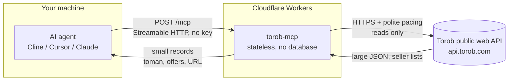

# Torob MCP - Price comparison intelligence for AI agents


[](https://github.com/mmdju/torob-mcp/actions/workflows/verify.yml)


**Real Torob knowledge for AI agents.** Search **Iran's price-comparison engine** from any MCP client (Cline, Cursor, Claude Desktop...): **prices in Toman**, every seller's offer on one product, price history, Torob's own product guides, shop profiles, today's deals. **Read-only, no API key, no login** - and answers measured in kilobytes instead of the ~70KB search page they came from.

**Live endpoint:** `https://torob-mcp.mmdju3.workers.dev/mcp` (Streamable HTTP, stateless) - opening the bare address in a browser shows [the site](https://torob-mcp.mmdju3.workers.dev/), and `GET /mcp` gets the connect page instead of a JSON error.

> [!IMPORTANT]
> **The hosted copy is not the main version - it is a quick-test demo.** It runs on Cloudflare, which Torob scores as a datacenter client, so it is **rate limited (20 `/mcp` calls a minute per client IP)** and **Torob pauses it from time to time**. For real use, run the main version on your own machine (below): no limit of ours, and its calls come from your own connection. See [Status](#status).

**[نسخه فارسی](README_FA.md)** · **[Examples](examples/sample-calls.md)** · **[Tool reference](docs/tools.md)** · **[Changelog](CHANGELOG.md)**

## Connect in 30 seconds

Any MCP client, **one URL**. Cline / Cursor / Claude Desktop (`mcp.json` style):

```json
{
  "mcpServers": {
    "torob": { "url": "https://torob-mcp.mmdju3.workers.dev/mcp" }
  }
}
```

Then just talk: **"ارزون‌ترین آیفون ۱۳ کجاست؟"**, **"هدفون زیر ۱۰ میلیون"**, **"این گوشی رو کجا بخرم بهتره؟"**, **"چی تخفیف خورده؟"**.

No client at hand? The whole protocol is one POST - a real call:

```bash
curl -sS https://torob-mcp.mmdju3.workers.dev/mcp \
  -H 'content-type: application/json' \
  -H 'accept: application/json, text/event-stream' \
  -d '{"jsonrpc":"2.0","id":1,"method":"tools/call","params":{"name":"search_products","arguments":{"query":"هدفون بی سیم","limit":2}}}'
```

And the answer that comes back inside that one message, trimmed to its bones:

```json
{
  "query": "هدفون بی سیم",
  "total_matches": 412,
  "total_matches_note": "Torob's own count is approximate - it changes between identical requests - so page with has_next_page rather than trusting the number.",
  "price_range_toman": { "min": 98000, "max": 2500000 },
  "products": [
    {
      "prk": "prk-a1b2c3d4-0000-4000-8000-000000000001",
      "name_fa": "هدفون بی‌سیم مدل P47",
      "price_toman": 238970,
      "available": true,
      "shop_name": "فروشگاه لوازم دیجیتال",
      "url": "https://torob.com/p/prk-a1b2c3d4-0000-4000-8000-000000000001/",
      "details_url": "https://api.torob.com/v4/base-product/details/?search_id=s1&prk=prk-a1b2c3d4-0000-4000-8000-000000000001"
    },
    {
      "prk": "prk-a1b2c3d4-0000-4000-8000-000000000002",
      "name_fa": "هدفون بلوتوثی مدل P9",
      "price_toman": 410000,
      "available": true,
      "shop_name": "پخش عمومی صوت",
      "url": "https://torob.com/p/prk-a1b2c3d4-0000-4000-8000-000000000002/"
    }
  ],
  "attribution": "Data comes from Torob's public web API. Prices, stock and seller offers change constantly - always confirm on torob.com before buying."
}
```

Agents running in a browser work too - the endpoint answers CORS preflights (`OPTIONS /mcp`).

### Or run it on your own machine

The same fifteen tools as a **local process** - no endpoint of ours, no rate limit of ours. What a run learns goes in `~/.torob-mcp/state.json`: the product names and links it found, and the wall it is waiting out. A restart keeps both; deleting that file starts you over.

One line - the first run is slower because npm builds it, and `git` must be installed, since one dependency (`fa-text-utils`) is fetched from a git repository:

```json
{
  "mcpServers": {
    "torob": { "command": "npx", "args": ["-y", "github:mmdju/torob-mcp"] }
  }
}
```

Or from a clone, if you would rather run code you can read:

```bash
git clone https://github.com/mmdju/torob-mcp.git
cd torob-mcp && npm install      # the prepare script builds dist/
```

```json
{
  "mcpServers": {
    "torob": { "command": "node", "args": ["/path/to/torob-mcp/dist/index.js"] }
  }
}
```

## 15 tools, grouped by the question

**Find it**

| Tool | What it answers |
|---|---|
| `torob_suggest` | Vague wording to **the search terms Torob itself suggests** |
| `search_products` | "Show me X", price checks - **filters, sorting, paging, price window** |
| `search_by_image` | "What is this?" - products matched to a **picture link**, no upload |
| `browse_categories` | Walk Torob's **category tree**, with each category's product count |
| `list_locations` | **Province and city ids**, plus the cities shoppers pick most |

**Know one product**

| Tool | What it answers |
|---|---|
| `product_details` | One product plus **every seller's offer** - online and **in person** - with the spec tables and the full price window |
| `product_guide` | "Should I buy this?" - **Torob's own write-up** of one model: what it is, its strengths and weaknesses, what buyers said |
| `price_history` | "Is now a good time to buy?" - Torob's **own price chart**, month by month, and when it last moved |

**Decide**

| Tool | What it answers |
|---|---|
| `similar_products` | "That one is too expensive, what else?" |
| `compare_products` | "Which of these?" - **only what actually differs**, plus the price spread |
| `find_best_value` | "Best X under Y Toman" - **ranked by what your budget actually reaches** |

**Shops and sellers**

| Tool | What it answers |
|---|---|
| `shop_profile` | "Is this seller any good?" - **Torob's own notes**, seal, score, delivery terms, and the shop's catalogue |
| `find_shops` | Find a **shop** by name or city, when the user names a store rather than a product |

**What is hot**

| Tool | What it answers |
|---|---|
| `torob_trends` | **What shoppers are searching right now**, each with a sample product |
| `special_offers` | **Today's featured deals**, kept separate from any product's seller list |

Every tool is read-only (`readOnlyHint: true`) and needs no credentials. Nothing here can order, message or contact a shop.

### Using it well

- **All prices are in Toman** (1 Toman = 10 Rial). Prices, stock and shop grades **move constantly** - always link the product URL so the user can confirm before buying.
- **A search card is one price - the cheapest offer.** `product_details` is the call that lists every seller, and its `price_spread_toman` is the whole reason a price-comparison source exists. It also returns the shops that sell **in person**, with each shelf price's age - so say how old it is.
- **A seller's `url` is the shop's page on torob.com.** The buy button's link is a tracked `api.torob.com` redirect that travels separately as `buy_url` - keep `url` in the answer, reach for `buy_url` only when the user is about to click through.
- **`price_history` is the honesty check on a price.** Compare today's cheapest offer with what Torob charts; the series labels are Torob's own, so quote them rather than inventing a trend.
- **`price_toman: null` means not available**, never 0 - and **0 is never free**: Torob's own "not for sale" comes back as `available: false`. **`price_unreliable: true`** is Torob saying the price cannot be trusted: pass the warning on, do not present it as a bargain.
- **A shop grade needs its vote count.** `shop_score: 5` with `shop_votes: 0` is normal and means "no votes yet", not "five-star shop".
- **An empty result is not proof a product does not exist.** The response carries `query_note` and Torob's own `suggested_queries` - retry with one of those instead of telling the user it is unavailable.
- **An unknown filter slug or value is refused with the real ones** (`available_filters` carries every group's accepted values). Torob ignores what it does not know and answers **unfiltered**, which is exactly why this server refuses first.
- **Torob answers a client that calls too fast with a bot challenge instead of data.** The server reports it plainly, never solves or evades it, and holds the rest of a burst for the whole cooldown. Details in [SECURITY.md](SECURITY.md).
- Results are **capped** (default 10, each tool's own maximum in [docs/tools.md](docs/tools.md)) to protect agent context, and Persian wording is folded (Arabic yeh/kaf, mixed digits, ZWNJ) when names are compared - the query reaches Torob exactly as typed.
- **[examples/sample-calls.md](examples/sample-calls.md)** has eleven copy-paste flows, **[docs/tools.md](docs/tools.md)** every parameter and filter slug, and **[docs/card.d.ts](docs/card.d.ts)** the response types.

## How it works

How a question becomes an answer. No user data is stored anywhere in this path.



- **Stateless.** Every request stands alone - no sessions, no accounts, nothing to log in to.
- **Read-only.** All 15 tools carry `readOnlyHint`. Nothing can change, delete or order anything.
- **Projected, not passed through.** A Torob search page is roughly 70KB of ranking metadata and experiment plumbing; every tool returns a compact record instead, with the seller list as a first-class `offers[]` array.
- **No user data.** What the server does keep: a short-lived response cache and a small map of product ids it handed out.
- **Rate-aware by necessity.** Upstream calls run one at a time with a 1.5s gap, and a challenge closes a gate the whole server shares instead of opening a retry storm.
- **Undocumented upstream.** Torob's API can change without notice, which is exactly why the [verify script](scripts/verify-live.mjs) exists.

## Trust, verified

Don't take my word for it - check the live server yourself:

```bash
node scripts/verify-live.mjs   # needs Node.js 18+, nothing to install
```

It drives the real endpoint the way an MCP client does and compares the version the live service reports against the newest release here, so a deployment that lags these docs cannot stay quiet. The same script runs **hourly in CI** ([](https://github.com/mmdju/torob-mcp/actions/workflows/verify.yml)); a **bot challenge is reported without failing the run**, because it is upstream's answer to a fast caller rather than a broken deploy. The unit suite - the badge that means the *code* is healthy - runs on every push ([](https://github.com/mmdju/torob-mcp/actions/workflows/test.yml)). Full path, including why a product id is not an address upstream: [docs/architecture.md](docs/architecture.md). Copy-paste client: [examples/python.py](examples/python.py).

## Run it yourself

```bash
npm install      # two runtime dependencies: the MCP SDK and a small Persian text helper
npm test         # builds, then runs every test in the repo
npm run dev      # the same Worker the live service runs, on your machine
npm run probe    # re-checks every upstream endpoint this server reads
```

Nothing to configure: no account, no key, no database, no bindings. `npm run build && npx wrangler deploy` puts your own copy on your own Cloudflare account.

## Status

**There are two versions, and the one to use is the one on your machine.**

- **The main version** is this repository, run by you: `npx -y github:mmdju/torob-mcp`, or a clone plus `node dist/index.js`. It has **no limit of ours**, and its calls come from your own connection.
- **A quick-test copy** is hosted for a first look at `https://torob-mcp.mmdju3.workers.dev/mcp` - free, read-only, keyless, **at most 20 `/mcp` calls a minute per client IP** (HTTP 429 with `retry-after` past that), and **Torob pauses it from time to time**. Both stops say so in their own text and name the main version, so nobody is left thinking the tools are broken.

Why it gets paused: measured 2026-10-09, **what Torob challenges is the connection, not what a client sends** - an ordinary connection answered every request shape, while a Cloudflare Worker drew a challenge page on its third call of the minute (a Worker's subrequests carry Cloudflare's `Cf-Worker` header, which cannot be removed). If you host your own copy and it keeps being challenged, run it locally or point `TOROB_API_BASE` at a relay you control: every upstream call, and every `details_url` it hands out, goes through that base. The measurement behind this is in the [changelog](CHANGELOG.md), the behaviour in [SECURITY.md](SECURITY.md).

## Data source

Torob's public web API (**undocumented, may change without notice**). This project is **not affiliated with or endorsed by Torob**.

## License

MIT - see [LICENSE](LICENSE). Security notes in [SECURITY.md](SECURITY.md). Persian version in [README_FA.md](README_FA.md).

*If this is useful, a star helps other builders find it.*
