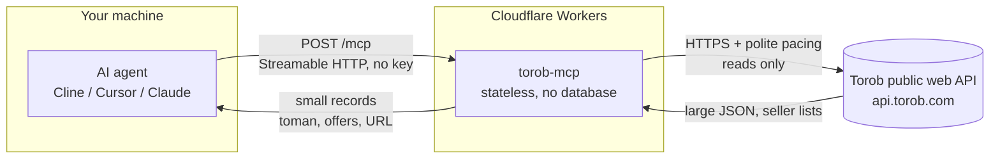

# Torob MCP - Price comparison intelligence for AI agents


A public MCP server that gives AI agents **real Torob knowledge**: search **Iran's price-comparison engine**, **prices in Toman**, **every seller's offer on one product**, shop grades and cities, delivery options, Torob's own filters, category tree, provinces and cities, and the deals it is featuring right now. **Read-only, no key needed. No login, ever.**

**Live endpoint:** `https://torob-mcp.mmdju.workers.dev/mcp` (Streamable HTTP, stateless)

**[نسخه فارسی](README_FA.md)** · **[Examples](examples/sample-calls.md)** · **[Tool reference](docs/tools.md)** · **[Changelog](CHANGELOG.md)**

## Connect in 30 seconds

Any MCP client, **one URL**. Cline / Cursor / Claude Desktop (`mcp.json` style):

```json
{
  "mcpServers": {
    "torob": { "url": "https://torob-mcp.mmdju.workers.dev/mcp" }
  }
}
```

Then just talk: **"ارزون‌ترین آیفون ۱۳ کجاست؟"**, **"هدفون زیر ۵۰۰ هزار"**, **"این گوشی رو کجا بخرم بهتره؟"**, **"چی تخفیف خورده؟"**.

Agents running in a browser work too - the endpoint answers CORS preflights (`OPTIONS /mcp`).

## 9 tools

| Tool | What it answers |
|---|---|
| `torob_suggest` | Vague wording to **the search terms Torob itself suggests** |
| `search_products` | "Show me X", price checks - **filters, sorting, paging, price window**, plus every filter that search accepts |
| `product_details` | One product plus **every seller's offer**, cheapest first: shop, city, grade, delivery |
| `similar_products` | "That one is too expensive, what else?" |
| `compare_products` | "Which of these?" - **only what actually differs**, plus the price spread |
| `find_best_value` | "Best X under Y Toman" - **ranked by what your budget actually reaches** |
| `browse_categories` | Walk Torob's **category tree**, with each category's product count |
| `list_locations` | **Province and city ids**, for delivery filtering |
| `special_offers` | **Today's featured deals**, kept separate from any product's seller list |

Every tool is read-only (`readOnlyHint: true`) and needs no credentials. Nothing here can order, message or contact a shop.

Notes for agent builders:

- **All prices are in Toman** (1 Toman = 10 Rial). Prices, stock and shop grades **move constantly** - always link the product URL so the user can confirm before buying.
- **A search card is one price - the cheapest offer.** `product_details` is the call that lists every seller, and the `price_spread_toman` between them is the whole reason a price-comparison source exists.
- **`price_toman: null` means not available** - out of stock upstream, or no price at all. It is never 0, and **0 is never free**: Torob's own "not for sale" comes back as `available: false`.
- **`price_unreliable: true` is Torob saying that price cannot be trusted.** Pass the warning on; do not present it as a bargain.
- **A shop grade needs its vote count.** Torob sends a score for nearly every offer but almost never the votes behind it, so `shop_score: 5` with `shop_votes: 0` is normal and means "no votes yet", not "five-star shop".
- **An empty result is not proof a product does not exist.** The response carries `query_note` plus Torob's own `suggested_queries` - retry with one of them instead of telling the user it is unavailable.
- **An unknown filter slug is refused with the real ones.** Torob ignores a slug it does not know and answers **unfiltered**, so a typo used to hand back a full unfiltered list that read as a filtered answer.
- **Torob answers a client that calls too fast with a bot challenge instead of data.** The server reports it plainly, never solves or evades it, and holds the rest of a burst for five minutes rather than retrying into a longer block. Details in [SECURITY.md](SECURITY.md).
- Results are **capped** (default 10, max 30) to protect agent context. Persian queries are normalized (yeh/kaf folding, Persian and Arabic-Indic digits, ZWNJ).
- **[examples/sample-calls.md](examples/sample-calls.md)** has six copy-paste flows, and **[docs/tools.md](docs/tools.md)** has every parameter and filter slug.

## How it works

How a question becomes an answer. No user data is stored anywhere in this path.



What this means:

- **Stateless.** Every request stands alone - no sessions, no accounts, nothing to log in to.
- **Read-only.** All 9 tools carry `readOnlyHint`. Nothing here can change, delete or order anything, and no shop is ever contacted.
- **Projected, not passed through.** A Torob search page is roughly 70KB of ranking metadata and experiment plumbing. Every tool returns a compact record built by the server's projection layer instead, with the seller list as a first-class `offers[]` array rather than a flattened string.
- **No user data.** Nothing about you is stored. What the server does keep: a short-lived response cache and a small map of product ids it handed out, so an id can be resolved back to its seller list.
- **Rate-aware by necessity.** Torob does not throttle with a 429 - it answers a client that calls too fast with a **bot challenge**. Upstream calls are serialized with a 1.5s gap, and a challenge opens a circuit breaker instead of a retry storm.
- **Undocumented upstream.** Torob's public API can change without notice, which is exactly why the [verify script](scripts/verify-live.mjs) exists.

## Trust, verified

Don't take my word for it - check the live server yourself:

```bash
node scripts/verify-live.mjs   # needs Node.js 18+, nothing to install
```

It drives the real endpoint the way an MCP client does, paces its calls, and compares the version the live service reports against the newest release in this repo - so a deployment that lags these docs cannot stay quiet. The same script runs **hourly in CI** ([](https://github.com/mmdju/torob-mcp/actions/workflows/verify.yml)) - a red badge means the deployment drifted, because the endpoint checks never touch Torob's edge. A **bot challenge is reported without failing the run**: it is upstream's answer to a fast caller, not a broken deploy, and it clears on its own. See [docs/architecture.md](docs/architecture.md) for the full path, including why a product id is not an address upstream and how a challenge is handled, and [examples/python.py](examples/python.py) for a copy-paste client.

## Data source

Torob's public web API (**undocumented, may change without notice**). This project is **not affiliated with or endorsed by Torob**.

## Status

**Free public service** on Cloudflare Workers, read-only and keyless. There is no per-IP rate limit on `/mcp` - the pacing this server applies is to **Torob**, not to you, because Torob challenges a caller that goes too fast. See [SECURITY.md](SECURITY.md).

## License

MIT - see [LICENSE](LICENSE). Security notes in [SECURITY.md](SECURITY.md). Persian version in [README_FA.md](README_FA.md).
