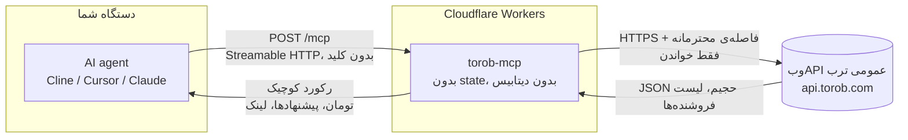

# ترب MCP - هوش مقایسه قیمت برای ایجنت‌ها


یه MCP سرور عمومیه که به ایجgent‌های هوش مصنوعی **دانش واقعی ترب** می‌ده: جستجو تو **موتور مقایسه قیمت ایران**، **قیمت به تومان**، **قیمت همه‌ی فروشنده‌های یک محصول**، درجه و شهر فروشگاه، گزینه‌های ارسال، فیلترهای خود ترب، درخت دسته‌بندی، استان‌ها و شهرها، و پیشنهادهای ویژه‌ی همین الان. **فقط خواندنیه، بدون کلید. بدون لاگین، همیشه.**

**آدرس زنده:** `https://torob-mcp.mmdju.workers.dev/mcp` (Streamable HTTP، بدون state)

**[English version](README.md)** · **[مثال‌ها](examples/sample-calls.md)** · **[مرجع ابزارها](docs/tools.md)** · **[تغییرات](CHANGELOG.md)**

## اتصال در ۳۰ ثانیه

هر MCP کلاینتی، **فقط یه آدرس**. Cline / Cursor / Claude Desktop (استایل `mcp.json`):

```json
{
  "mcpServers": {
    "torob": { "url": "https://torob-mcp.mmdju.workers.dev/mcp" }
  }
}
```

بعدش فقط حرف بزن: **«ارزون‌ترین آیفون ۱۳ کجاست؟»**، **«هدفون زیر ۵۰۰ هزار»**، **«این گوشی رو کجا بخرم بهتره؟»**، **«چی تخفیف خورده؟»**.

کلاینت‌های MCP توی مرورگر هم کار می‌کنن - endpoint جواب preflight مرورگر (`OPTIONS /mcp`) رو می‌ده.

## ۹ ابزار

| ابزار | به چه دردی می‌خوره |
|---|---|
| `torob_suggest` | حرف مبهم به **عبارت‌هایی که خود ترب پیشنهاد می‌ده** |
| `search_products` | «اینو نشونم بده»، چک قیمت - **فیلتر، مرتب‌سازی، صفحه‌بندی، بازه قیمت**، به‌علاوه‌ی همه‌ی فیلترهایی که اون سرچ قبول داره |
| `product_details` | یک محصول به‌علاوه‌ی **قیمت همه‌ی فروشنده‌ها**، از ارزون به گرون: فروشگاه، شهر، درجه، ارسال |
| `similar_products` | «این گرون شد، پس چی بگیرم؟» |
| `compare_products` | «کدومشون؟» - **فقط چیزهایی که واقعاً فرق دارن**، به‌علاوه‌ی فاصله قیمت |
| `find_best_value` | «بهترین X زیر Y تومان» - **رتبه‌بندی بر اساس چیزی که بودجه‌ات واقعاً به آن می‌رسه** |
| `browse_categories` | پیمایش **درخت دسته‌بندی** ترب، با تعداد محصول هر دسته |
| `list_locations` | **آیدی استان و شهر**، برای فیلتر ارسال |
| `special_offers` | **پیشنهادهای ویژه امروز**، جدا از فهرست فروشنده‌های هر محصول |

هر ۹ ابزار فقط خواندنیه (`readOnlyHint`) و هیچ کلید یا حسابی نمی‌خواد. اینجا هیچ‌چیزی نمی‌تونه سفارش بده، پیام بده یا با فروشگاه تماس بگیره.

نکته‌ها برای سازنده‌های ایجgent:

- همه‌ی قیمت‌ها **تومانن** (۱ تومان = ۱۰ ریال). قیمت، موجودی و درجه‌ی فروشگاه **مدام عوض می‌شه** - همیشه لینک محصول رو بده تا کاربر خودش چک کنه.
- **کارت سرچ یه قیمته - ارزون‌ترین پیشنهاد.** `product_details` اون callـیه که همه‌ی فروشنده‌ها رو لیست می‌کنه، و `price_spread_toman` بینشون دقیقاً همون چیزیه که دلیل وجود یه سایت مقایسه قیمته.
- **`price_toman: null` یعنی موجود نیست** - یا ناموجوده بالادست ترب، یا اصلاً قیمتی نداره. هیچ‌وقت ۰ نیست، و **۰ هیچ‌وقت رایگان نیست**: «ناموجود» خود ترب میاد با `available: false`.
- **`price_unreliable: true` یعنی خود ترب می‌گه این قیمت قابل اعتماد نیست.** هشدار رو منتقل کن؛ به‌عنوان پیشنهاد خوب معرفیش نکن.
- **درجه‌ی فروشگاه بدون تعداد رأی معنی نداره.** ترب برای تقریباً هر پیشنهادی امتیاز می‌فرسته ولی تقریباً هیچ‌وقت تعداد رأی رو نه، پس `shop_score: 5` با `shop_votes: 0` عادیه یعنی «هنوز رأیی نخورده»، نه «فروشگاه پنج‌ستاره».
- **نتیجه‌ی خالی ثابت نمی‌کنه محصول وجود نداره.** جواب با خودش `query_note` و `suggested_queries` ترب رو می‌اره - با یکی از اون‌ها دوباره امتحان کن، به‌جای اینکه به کاربر بگی موجود نیست.
- **فیلتر ناشناخته با فیلترهای واقعی رد می‌شه.** ترب اسلاگی که نشناسه رو نادیده می‌گیره و **بدون فیلتر** جواب می‌ده، پس یه تایپ اشتباه قبلاً یه لیست کامل بدون فیلتر برمی‌گردوند که جوابِ فیلترشده به نظر می‌رسید.
- **ترب به کلاینتی که تند صدا بزنه، به‌جای داده چالش رباتی می‌ده.** سرور صریح می‌گه چی شده، هیچ‌وقت حل یا دورش نمی‌کنه، و پنج دقیقه بقیه‌ی یه هجوم رو نگه می‌داره به‌جای اینکه با ری‌تری بلاک رو درازتر کنه. جزئیات تو [SECURITY.md](SECURITY.md).
- نتیجه‌ها **سقف دارن** (پیش‌فرض ۱۰، حداکثر ۳۰) برای حفظ کانتکست ایجgent. فارسی هم نرمال می‌شه (ی/ک عربی، ارقام فارسی و عربی، نیم‌فاصله).
- **شش مکالمه‌ی آماده‌ی کپی-پیست** تو **[examples/sample-calls.md](examples/sample-calls.md)** هست، و مرجع کامل پارامترها و فیلترها تو **[docs/tools.md](docs/tools.md)**.

## چطور کار می‌کنه

یه سؤال چطور به جواب تبدیل می‌شه. تو این مسیر هیچ داده‌ای از کاربر ذخیره نمی‌شه.



یعنی چی:

- **بدون state.** هر درخواست مستقلِ - بدون سشن، بدون اکانت، بدون چیزی که لازم باشه لاگین کنی.
- **فقط خواندنی.** هر ۹ ابزار `readOnlyHint` دارن. اینجا هیچ‌چیزی نمی‌تونه چیزی رو عوض یا پاک کنه یا سفارش بده، و هیچ فروشگاهی هم تماس نمی‌گیره.
- **پروجکشن می‌شه، پاس‌تیود نمی‌شه.** صفحه‌ی جستجوی ترب حدود ۷۰ کیلوبایت متادیتای رنک و شناسه‌ی آزمایشه. هر ابزار به‌جای اون یه رکورد فشرده برمی‌گردونه که لایه‌ی پروجکشن سرور ساخته، و لیست فروشنده‌ها یه آرایه‌ی واقعی `offers[]` میاد نه یه رشته‌ی تخت.
- **بدون داده‌ی کاربر.** هیچی از تو ذخیره نمی‌شه. تنها چیزی که می‌مونه یه کش کوتاه‌مدت و یه نقشه‌ی کوچیک از آیدی محصولاتی که خودش داده.
- **حواس‌جمع به لید، از سر اجبار.** ترب با ۴۲۹ لین نمی‌کنه - به کلاینتی که تند بره **چالش رباتی** می‌ده. درخواست‌های بالادستی با فاصله‌ی ۱.۵ ثانیه سریال می‌شن و یه چالش، مدار بازکن می‌زنه به‌جای طوفان ری‌تری.
- **API مستندنشده.** وب‌API عمومی ترب بدون اطلاع عوض می‌شه؛ برای همین همین [اسکریپت verify](scripts/verify-live.mjs) وجود داره تا این تغییرات دیده بشن。

## اعتماد، قابل راستی‌آزمایی

حرف منو قبول نکن - خودت سرور زنده رو چک کن:

```bash
node scripts/verify-live.mjs   # فقط Node.js ۱۸ می‌خواد، نصب لازم نداره
```

این اسکریپت endpoint واقعی رو همون‌طوری که یه کلاینت MCP می‌زنه می‌راند، فاصله‌ی call‌هاش رو رعایت می‌کنه، و نسخه‌ای که سرویس زنده گزارش می‌ده رو با آخرین ریلیز همین ریپو مقایسه می‌کنه - یعنی یه دیپلوی عقب‌مونده نمی‌تونه بی‌صدا بمونه. همون اسکریپت **ساعتی تو CI** هم اجرا می‌شه ([](https://github.com/mmdju/torob-mcp/actions/workflows/verify.yml)) - بج قرمز یعنی دیپلوی منحرف شده، چون چک‌های endpoint اصلاً به لبه‌ی ترب دست نمی‌زنن. **چالش رباتی گزارش می‌شه ولی ران قرمز نمی‌کنه**: جواب ترب به یه کلاینت تنده، نه دیپلوی خراب، و خودش پاک می‌شه. معماری کامل، از جمله اینکه چرا آیدی محصول بالادستی آدرس نیست و چالش چطور مدیریت می‌شه، تو [docs/architecture.md](docs/architecture.md) هست، و کلاینت آماده تو [examples/python.py](examples/python.py).

## منبع داده

وب‌API عمومی ترب (**مستند نیست، بدون اطلاع قبلی عوض می‌شه**). این پروژه **وابسته به ترب نیست** و تأییدش رو نداره.

## وضعیت

**سرویس عمومی رایگان** روی Cloudflare Workers، فقط خواندنی و بدون کلید. روی `/mcp` محدودیت نرخ به‌ازای هر IP نیست - فاصله‌گذاری‌ای که این سرور رعایت می‌کنه برای **ترب**ه، نه برای تو، چون ترب به کلاینت تند چالش می‌ده. جزئیات تو [SECURITY.md](SECURITY.md).

## لایسنس

پروانه MIT — ببین [LICENSE](LICENSE). نکته‌های امنیتی تو [SECURITY.md](SECURITY.md). نسخه‌ی انگلیسی تو [README.md](README.md).
