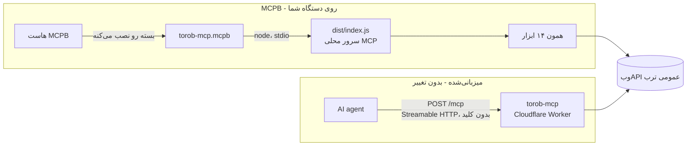
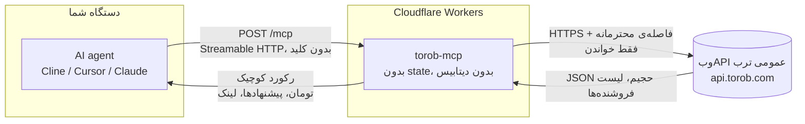

# ترب MCP - هوش مقایسه قیمت برای ایجنت‌ها


یه MCP سرور عمومیه که به ایجنت‌های هوش مصنوعی **دانش واقعی ترب** می‌ده: جستجو تو **موتور مقایسه قیمت ایران**، **قیمت به تومان**، **قیمت همه‌ی فروشنده‌های یک محصول**، **تاریخچه و روند قیمت**، **پروفایل فروشنده‌ها**، فروشنده‌های حضوری، درجه و شهر فروشگاه، گزینه‌های ارسال، فیلترهای خود ترب، درخت دسته‌بندی، استان‌ها و شهرها، و پیشنهادهای ویژه‌ی همین الان. **فقط خواندنیه، بدون کلید. بدون لاگین، همیشه.**

**آدرس زنده:** `https://torob-mcp.mmdju3.workers.dev/mcp` (Streamable HTTP، بدون state) - اگه همین آدرس رو بدون `/mcp` تو مرورگر باز کنی [سایت](https://torob-mcp.mmdju3.workers.dev/) رو می‌بینی، و `GET /mcp` صفحه‌ی راهنمای اتصال رو می‌ده به‌جای خطای JSON.

**[English version](README.md)** · **[مثال‌ها](examples/sample-calls.md)** · **[مرجع ابزارها](docs/tools.md)** · **[تغییرات](CHANGELOG.md)**

## اتصال در ۳۰ ثانیه

هر MCP کلاینتی، **فقط یه آدرس**. Cline / Cursor / Claude Desktop (استایل `mcp.json`):

```json
{
  "mcpServers": {
    "torob": { "url": "https://torob-mcp.mmdju3.workers.dev/mcp" }
  }
}
```

بعدش فقط حرف بزن: **«ارزون‌ترین آیفون ۱۳ کجاست؟»**، **«هدفون زیر ۱۰ میلیون»**، **«این گوشی رو کجا بخرم بهتره؟»**، **«چی تخفیف خورده؟»**.

کلاینت‌های MCP توی مرورگر هم کار می‌کنن - endpoint جواب preflight مرورگر (`OPTIONS /mcp`) رو می‌ده.

### یا لوکال، روی خودِ ماشینت اجراش کن

همون ۱۴ ابزار، ولی به‌عنوان یک **پروسهٔ محلی** — نه endpointِ ما، نه محدودیتِ نرخِ خودمون. هر چیزی که یه اجرا یاد می‌گیره می‌ره توی `~/.torob-mcp/state.json`: اسم و لینکِ محصولاتی که پیدا کرد، و دیواری که داره صبرش می‌کنه. ری‌استارت هر دو رو نگه می‌داره؛ پاک کردنِ اون فایل همه‌چیز رو از نو شروع می‌کنه.

یک خط — بار اول کُندتره چون npm می‌سازتش، و باید `git` نصب باشه، چون یکی از وابستگی‌ها (`fa-text-utils`) از یک مخزنِ گیت میاد:

```json
{
  "mcpServers": {
    "torob": { "command": "npx", "args": ["-y", "github:mmdju/torob-mcp"] }
  }
}
```

یا از یک کلون، اگه دوست داری کدی رو اجرا کنی که خودت می‌تونی بخونیش:

```bash
git clone https://github.com/mmdju/torob-mcp.git
cd torob-mcp && npm install      # اسکریپتِ prepare خودش dist/ رو می‌سازه
```

```json
{
  "mcpServers": {
    "torob": { "command": "node", "args": ["/path/to/torob-mcp/dist/index.js"] }
  }
}
```

### یا به‌شکل بستهٔ MCPB نصبش کن

همون سرور محلی، ولی به‌شکل **یک فایل**، در همون قالبی که هاست‌های MCPB نصب می‌کنن. با `npm run build:mcpb` بسازش و فایل `build/torob-mcp.mcpb` رو به هاست بده - جزئیات کاملش تو بخش **«بستهٔ MCPB»** پایین همین صفحه‌ست.

## ۱۴ ابزار

| ابزار | به چه دردی می‌خوره | چی می‌خواد |
|---|---|---|
| `torob_suggest` | حرف مبهم به **عبارت‌هایی که خود ترب پیشنهاد می‌ده** | `query` |
| `search_products` | «اینو نشونم بده»، چک قیمت - **فیلتر، مرتب‌سازی، صفحه‌بندی، بازه قیمت**، به‌علاوه‌ی همه‌ی فیلترهایی که اون سرچ قبول داره | `query`؛ `city` آیدیِ یکی از خروجی‌های `list_locations`ـه |
| `product_details` | یک محصول به‌علاوه‌ی **قیمت همه‌ی فروشنده‌ها** (آنلاین و **حضوری**)، با مشخصات فنی و کل بازه‌ی قیمت | `prk`، یا `details_url` همون کارتِ سرچ |
| `price_history` | «الان بخرم یا صبر کنم؟» - **نمودار قیمت خود ترب**، ماه‌به‌ماه، و اینکه آخرین بار کِی عوض شده | `prk` |
| `similar_products` | «این گرون شد، پس چی بگیرم؟» | `prk` |
| `compare_products` | «کدومشون؟» - **فقط چیزهایی که واقعاً فرق دارن**، به‌علاوه‌ی فاصله قیمت | `prks`: دو تا پنج محصول |
| `find_best_value` | «بهترین X زیر Y تومان» - **رتبه‌بندی بر اساس چیزی که بودجه‌ات واقعاً به آن می‌رسه** | `query`؛ `budget_toman` اختیاریه |
| `shop_profile` | «این فروشنده قابل اعتماده؟» - **نکته‌های خود ترب**، نماد اعتماد، امتیاز، شرایط ارسال، و لیست کالاهاش | `shop_id` - آیدیِ عددیِ هر پیشنهاد |
| `find_shops` | پیدا کردن **فروشگاه** با اسم یا شهر، وقتی کاربر اسم یه فروشگاه رو می‌گه | `query` و/یا `city`، هر دو اختیاری |
| `search_by_image` | «این چیه؟» - محصول‌های مشابه **یه لینک عکس**، بدون آپلود | `image_url`: یه لینک عمومی http(s) |
| `torob_trends` | **مردم الان چی سرچ می‌کنن**، هر کدام با یک کالای نمونه | هیچی |
| `browse_categories` | پیمایش **درخت دسته‌بندی** ترب، با تعداد محصول هر دسته | `id`؛ `1` بالاترین سطحه |
| `list_locations` | **آیدی استان و شهر**، به‌علاوه‌ی شهرهایی که کاربرهای ترب بیشتر انتخاب می‌کنن | `province_id` اختیاریه؛ اگه ندهی، لیست استان‌ها رو می‌ده |
| `special_offers` | **پیشنهادهای ویژه امروز**، جدا از فهرست فروشنده‌های هر محصول | هیچی |

هر ۱۴ ابزار فقط خواندنیه (`readOnlyHint`) و هیچ کلید یا حسابی نمی‌خواد. اینجا هیچ‌چیزی نمی‌تونه سفارش بده، پیام بده یا با فروشگاه تماس بگیره. `prk` و `shop_id` فقط وقتی معنا دارن که این سرور قبلاً همون‌ها رو بهت داده باشه - آیدی محصول ترب بالادستی آدرس نیست، و توضیحش تو [docs/architecture.md](docs/architecture.md)ـه. هر پارامتر، هر اسلاگ فیلتر و هر فیلد خروجی تو [docs/tools.md](docs/tools.md)ـه.

نکته‌ها برای سازنده‌های ایجنت:

- همه‌ی قیمت‌ها **تومانن** (۱ تومان = ۱۰ ریال). قیمت، موجودی و درجه‌ی فروشگاه **مدام عوض می‌شه** - همیشه لینک محصول رو بده تا کاربر خودش چک کنه.
- **کارت سرچ یه قیمته - ارزون‌ترین پیشنهاد.** `product_details` اون callـیه که همه‌ی فروشنده‌ها رو لیست می‌کنه، و `price_spread_toman` بینشون دقیقاً همون چیزیه که دلیل وجود یه سایت مقایسه قیمته. همون جواب، فروشگاه‌های **حضوری** رو هم می‌ده (`in_person_sellers`) - هر قیمت فروشگاه تاریخِ آخرین تغییرش رو همراه خودش داره، پس اگه قدیمیه بگو.
- **`price_history` چکِ صداقتِ قیمته.** قیمت امروز رو با نمودار خود ترب مقایسه کن؛ اسم سری‌ها مال خود تربه، پس همون‌ها رو نقل کن و از خودت روند نساز.
- **`price_toman: null` یعنی موجود نیست** - یا ناموجوده بالادست ترب، یا اصلاً قیمتی نداره. هیچ‌وقت ۰ نیست، و **۰ هیچ‌وقت رایگان نیست**: «ناموجود» خود ترب میاد با `available: false`.
- **`price_unreliable: true` یعنی خود ترب می‌گه این قیمت قابل اعتماد نیست.** هشدار رو منتقل کن؛ به‌عنوان پیشنهاد خوب معرفیش نکن.
- **درجه‌ی فروشگاه بدون تعداد رأی معنی نداره.** ترب برای تقریباً هر پیشنهادی امتیاز می‌فرسته ولی تقریباً هیچ‌وقت تعداد رأی رو نه، پس `shop_score: 5` با `shop_votes: 0` عادیه یعنی «هنوز رأیی نخورده»، نه «فروشگاه پنج‌ستاره».
- **نتیجه‌ی خالی ثابت نمی‌کنه محصول وجود نداره.** جواب با خودش `query_note` و `suggested_queries` ترب رو می‌اره - با یکی از اون‌ها دوباره امتحان کن، به‌جای اینکه به کاربر بگی موجود نیست.
- **فیلتر یا مقدار ناشناخته با فیلترهای واقعی رد می‌شه.** `available_filters` حالا خودِ مقادیر مجاز هر گروه رو (`options`، به‌علاوه‌ی `values_url` برای لیست کامل برند) می‌آره؛ ترب اسلاگ یا مقداری که نشناسه رو نادیده می‌گیره و **بدون فیلتر** جواب می‌ده، پس یه تایپ اشتباه قبلاً یه لیست کامل بدون فیلتر برمی‌گردوند که جوابِ فیلترشده به نظر می‌رسید.
- **ترب به کلاینتی که تند صدا بزنه، به‌جای داده چالش رباتی می‌ده.** سرور صریح می‌گه چی شده، هیچ‌وقت حل یا دورش نمی‌کنه، و بقیه‌ی یه هجوم رو تا آخرِ مهلت نگه می‌داره به‌جای اینکه با ری‌تری بلاک رو درازتر کنه. جزئیات تو [SECURITY.md](SECURITY.md).
- نتیجه‌ها **سقف دارن** (پیش‌فرض ۱۰؛ سقفِ خودِ هر ابزار - ۲۴ توی جستجوی محصول، ۳۰ توی بیشتر لیست‌ها - توی [docs/tools.md](docs/tools.md) هست) برای حفظ کانتکست ایجنت. فارسی موقع مقایسه‌ی کلیدهای کش و اسم محصول‌ها فولد می‌شه (ی/ک عربی، ارقام فارسی و عربی، نیم‌فاصله حفظ می‌شه) - خود کوئری بدون تغییر به ترب می‌ره و ترب هم همین‌طوری فولدش می‌کنه.
- **یازده مکالمه‌ی آماده‌ی کپی-پیست** تو **[examples/sample-calls.md](examples/sample-calls.md)** هست، مرجع کامل پارامترها و فیلترها تو **[docs/tools.md](docs/tools.md)**، و تایپِ خروجی‌ها هم تو **[docs/card.d.ts](docs/card.d.ts)**.

## بستهٔ MCPB

سرور محلی به‌شکل **یک فایل**. **MCP** پروتکلیه که ایجنت و سرور باهاش حرف می‌زنن. **MCPB** بسته‌ایه که اون سرور داخلش تحویل داده می‌شه - همون یک فایلی که هاست نصب می‌کنه و بدون build، بدون `git` و بدون جمع‌کردنِ `node_modules`، یه سرور MCP محلی به دست می‌آره. هم قالب و هم پسوندش از DXT تغییر نام دادن؛ این مخزن `.mcpb` می‌سازه.

### دو راه برای رسیدن به همون ۱۴ ابزار

MCPB مسیر **محلی**ه. جای دیپلوی میزبانی‌شده رو نمی‌گیره، و هیچ‌چیز تو این بخش اون رو عوض نمی‌کنه.



- **ریموت** - یه آدرس، بدون نصب، زیرساختِ مشترک، و محدودیتِ ۲۰ درخواست در دقیقه که پایین‌تر، تو بخش وضعیت، توضیح داده شده.
- **MCPB** - بدون endpointِ ما تو مسیر، و بدون محدودیتِ ما. فاصله‌گذاری و دیوارِ رباتی ترب همچنان اعمال می‌شه، چون این درخواست‌ها همچنان درخواست‌های تربن.

### بساز و نصب کن

```bash
git clone https://github.com/mmdju/torob-mcp.git
cd torob-mcp
npm ci               # یا npm install - اسکریپتِ prepare خودش dist/ رو می‌سازه
npm run build:mcpb   # -> build/torob-mcp.mcpb
```

خروجی همون `build/torob-mcp.mcpb`ـه. هاستی که MCPB رو می‌فهمه، از مسیر import بستهٔ خودش نصبش می‌کنه - فایل رو بهش نشون بده - و بعد دقیقاً همون‌طور که manifest می‌گه اجراش می‌کنه. هیچ ورودی رجیستری، هیچ کانال آپدیت و هیچ فایل ازپیش‌ساخته‌ای از این مخزن منتشر نمی‌شه: **خودت می‌سازیش**، پس چیزی که نصب می‌کنی همون کدِ کلونیه که خودت می‌تونی بخونیش.

قبل از اینکه چیزی نصب کنی، نگاه کن داخلش چیه:

```bash
npx mcpb info build/torob-mcp.mcpb
# File: torob-mcp.mcpb
# Size: 4031.82 KB
# WARNING: Not signed
```

بسته **امضا نشده**، و اینجا هم وانمود نمی‌کنیم که هست: بیلد امضا نمی‌کنه، `mcpb sign` کلیدی می‌خواد که این پروژه نداره، و هاستی که امضا بخواد بسته رو رد می‌کنه.

### بیلد واقعاً چیکار می‌کنه

`npm run build:mcpb` اول `tsc` رو اجرا می‌کنه و بعد `node scripts/build-mcpb.mjs` رو. این اسکریپت:

1. **پوشهٔ staging یعنی `build/mcpb/` رو از صفر می‌سازه**، پس فایلی که از سورس پاک شده نمی‌تونه تو بسته زنده بمونه.
2. **ایمپورت‌های entry point رو دنبال می‌کنه.** از `dist/index.js` شروع می‌کنه و ایمپورت‌های نسبیِ ثابت رو دنبال می‌کنه و هر ماژولی رو که می‌رسه کپی می‌کنه - یازده تا. `dist/` هم بیلد Node رو داره هم بیلد Worker، پس همین دنبال‌کردنه که `worker.js`، `rate-limit.js`، `og-image.js` و `fonts.js` رو بیرون نگه می‌داره؛ ایمپورتی که resolve نشه خطای بیلده، نه بستهٔ خراب تو هستِ یکی.
3. **درختِ وابستگی‌های production رو کپی می‌کنه** از همون `node_modules`ـی که npm ساخته، با جواب خود npm به این سؤال که «این پکیج برای اجرا چی می‌خواد» (`npm ls --omit=dev`)، و با کنار گذاشتن چیزهایی که npm اضافه گزارش می‌کنه (`extraneous`). بسته بیرون از هر نصبی `node` رو اجرا می‌کنه، پس باید همراهش بیاره.
4. **دو فایل از خودش می‌نویسه**: یه `package.json` کم‌وکم - `"type": "module"` اختیاری نیست، چون `dist/*.js` ماژول ES هستن و Node وگرنه entry رو CommonJS می‌خونه و روی همون اولین import می‌مکه - و manifest، با `version`ـی که از `package.json` گرفته شده. `.mcpbignore` هم همراه پوشهٔ staging میاد.
5. **پوشه رو به CLI رسمی می‌ده.** `@anthropic-ai/mcpb` به‌عنوان devDependency با نسخهٔ دقیق پین شده و از `node_modules` پیدا می‌شه، پس خروجی هیچ‌وقت به چیزی که یه ماشین سراسری نصب کرده وابسته نیست. CLI خودش اعتبارسنجی می‌کنه (`mcpb validate`) و بسته‌بندی می‌کنه (`mcpb pack`).
6. **آرشیو رو دوباره می‌خونه.** همون چیزی رو که همین حالا نوشته باز می‌کنه (`mcpb unpack`) و بعد چک می‌کنه که هر فایل لازم سر جاشه - `manifest.json`، `package.json`، خود entry، `dist/server.js`، `dist/tools.js`، `dist/project.js` و هر دو وابستگی زمان‌اجرا - نسخهٔ manifest با `package.json` یکیه، و هیچ‌چیزِ ممناهی همراهش نیومده: `.env*`، `.dev.vars`، `.git`، `node_modules/.bin`، `tsconfig.json`، `package-lock.json`، `*.pem`، `*.key`، `*.mcpb`، `*.tgz`، `*.log`، `*.map` یا ماژول‌های مخصوص Worker. هر کدوم از اینا بیلد رو رد می‌کنه.

به یه `node_modules` از قبل موجود نیاز داره؛ خودش چیزی نصب نمی‌کنه، از شبکه استفاده نمی‌کنه و git صدا نمی‌زنه. نتیجه: حدود ۱۲ مگابایت باز، کمتر از ۴ مگابایت فشرده، که تقریباً همه‌ش SDK مک‌پی و وابستگی‌هایشه. `build/` تو `.gitignore`ـه - بسته آرتیفکته، نه فایل سورس.

### داخل بسته چیه

```text
build/torob-mcp.mcpb
├── manifest.json        اسم، نسخه، توضیح، سازگاری، اسم ۱۴ ابزار
├── package.json         کم‌وکم: type: module، به‌علاوهٔ فهرست وابستگی‌های زمان‌اجرا
├── dist/                یازده ماژولی که dist/index.js ایمپورت می‌کنه
│   ├── index.js         entry point محلی - پیش‌فرض stdio، با --http هم می‌شه
│   ├── server.js        buildServer() - همون کدی که ورکر هم اجرا می‌کنه
│   ├── tools.js         چهارده ابزار
│   ├── project.js       لایهٔ پروجکشن
│   └── …
└── node_modules/        درختِ وابستگی‌های زمان‌اجرا (۹۵ پکیج)
```

عمداً داخلش نیست: `src/`، `tests/`، `scripts/`، `docs/`، `landing/`، `assets/`، `.github/`، `.wrangler/`، بیلد ورکر، `.env*`، کلید و گواهی، lockfile و `node_modules/.bin`. روی این‌ها، خود CLI هم `.git`، `*.d.ts` و source map‌ها رو حذف می‌کنه، و `.mcpbignore` یه لایهٔ دوم دفاعه - با اینکه فهرست staging از قبل این مسیرها رو کنار گذاشته - تا یه تغییر تو کدِ staging نتونه از روی اشتباه secretی رو روانه کنه، و تا `mcpb pack .` تو یه کلون هم امن باشه.

### همون سروره، نه یه پیاده‌سازی دوم

این تصمیمیه که ارزش دونستن داره: **بسته هیچ پیاده‌سازی دومی از هیچ‌چیز نداره.** همون `dist/index.js` رو اجرا می‌کنه - همون entry pointـی که `node dist/index.js` از اول اجرا می‌کرده - روی stdio، با `${__dirname}` که به همون‌جایی اشاره می‌کنه که هاست بازش کرده.

```text
                  MCPB
                    │
                    ▼
          ${__dirname}/dist/index.js
                    │
                    ▼
          buildServer()  ← src/server.ts، مشترک با ورکر
                    │
            ┌───────┴───────┐
            ▼               ▼
       ۱۴ ابزار        وب‌API عمومی ترب
```

پس ابزارها، لایهٔ پروجکشن، یکپارچگی با ترب، فاصله‌گذاری و دروازهٔ دیوار رباتی، تو هر استقراری همون کدن. نسخهٔ محلی، MCPB و نسخهٔ میزبانی‌شده نمی‌تونن از هم جدا بیفتن، چون فقط یه نسخه از منطق وجود داره - و یه فیکس برای یه ابزار، همه‌جا فیکسه، بدون اینکه بسته‌ای دستی بازساخته بشه.

کلِ ماجرا این بلوک `server` تو manifestـه:

```json
{
  "type": "node",
  "entry_point": "dist/index.js",
  "mcp_config": { "command": "node", "args": ["${__dirname}/dist/index.js"] }
}
```

### پیکربندی: هیچی

manifest هیچ **`user_config`**ـی اعلام نمی‌کنه، و هاست MCPB هم ازت چیزی نمی‌پرسه. این وضعیتِ درسته، نه یه کاستی: ترب کلید نمی‌خواد، این سرور هیچ‌وقت لاگین نمی‌کنه، و یه پرامپت یعنی خواستنِ اعتبارنامه‌ای که هیچ استفاده‌ای نداره. manifest نه بلوک `env` داره، نه `platform_overrides`، نه secret.

دو متغیر محیطی هست که همچنان اختیارین، و هر دو از قبل برای اجرای محلی وجود داشتن - به محیط هست تعلق دارن، نه به بسته:

| متغیر | پیش‌فرض | چیکار می‌کنه |
|---|---|---|
| `TOROB_MCP_HOME` | `~/.torob-mcp` | این store کجا `state.json` رو نگه می‌داره |
| `TOROB_MCP_STORE=off` | store روشنه | store رو کامل خاموش می‌کنه |

این store دو چیز نگه می‌داره: اسم و آدرسِ صفحهٔ جزئیاتِ یک محصول، و نشانهٔ اینکه دیوار ترب هنوز بالاست. پاک کردن فایل، سرور رو کامل ری‌ست می‌کنه.

### چطور راستی‌آزماییش کنی

```bash
npm test                        # کل تست‌ها، شامل گیت‌های manifest بستهٔ MCPB
npm run typecheck               # tsc --noEmit
npm run build:mcpb              # بیلد، بسته‌بندی، و بعد بازخوانیِ آرشیو
node scripts/verify-mcpb.mjs    # اجرای واقعیِ بستهٔ پک‌شده
```

- **`npm test`** کنار بقیهٔ تست‌ها، `tests/mcpb.test.mjs` رو هم اجرا می‌کنه: manifest با اسکیمایی که خود CLI پین‌شده منتشر می‌کنه اعتبارسنجی می‌شه - نه یه کپی ازش - نسخه‌اش به `package.json` قفله، entry point و `mcp_config`ـش با همون فایلی که سرور محلی واقعاً اجرا می‌کنه سنجیده می‌شه، اسم ابزارهایی که اعلام می‌کنه باید با `TOOLS` یکی باشه، و هیچ `user_config`، بلوک `env`، مسیر مطلق یا مسیرِ مخصوص ماشینِ یه توسعه‌دهنده توش اجازه داده نمی‌شه.
- **`npm run build:mcpb`** تو CI هم روی هر push اجرا می‌شه ([](https://github.com/mmdju/torob-mcp/actions/workflows/test.yml))، چون تست‌های بالا manifest رو چک می‌کنن و فقط بیلد آرتیفکت رو.
- **`node scripts/verify-mcpb.mjs`** اون یکیه که ثابت می‌کنه آرتیفکت واقعاً *اجرا* می‌شه. بسته رو توی یه پوشهٔ خالی بیرون از مخزن باز می‌کنه، دقیقاً همون‌طور که `mcp_config` می‌گه اجراش می‌کنه، handshakeـی `initialize` رو کامل می‌کنه، نسخه‌ای که سرور گزارش می‌کنه رو با manifest می‌سنجد، ابزارها رو فهرست می‌کنه و با اسم‌های اعلام‌شده مقایسه می‌کنه، بعد یه فراخوانی واقعی و فقط‌خواندنی - `torob_suggest`، ارزون‌ترینشون - به ترب می‌زنه. چالش رباتی به‌عنوان همون چیزی که هست گزارش می‌شه و ران رو قرمز نمی‌کنه. به شبکه نیاز داره، پس دستی اجرا می‌شه.

### نکته‌های امنیتی بسته

- **با هویت تو اجرا می‌شه.** هاست یه پروسهٔ واقعی `node` رو بالا می‌آره؛ هر کاری که سرور بکنه، با دسترسی و شبکهٔ تو بکنه. بسته یه قالب توزیعه، نه یه sandbox.
- **هیچ اعتبارنامه‌ای حمل نمی‌کنه**، چون اصلاً وجود نداره - نه کلید، نه اکانت، نه توکن، نه فایل `.env`ـای که هاست پرش کنه. اگه این سرور یه روز به یکی نیاز پیدا کنه، جای درستش یه پرامپت `user_config` تو MCPBـه، نه یه فایل داخل آرشیو.
- **بیلد اجازه نمی‌ده secretی رد کنه.** فهرست staging از گراف ایمپورت‌ها و درختِ production خود npm ساخته می‌شه، هیچ‌وقت از «هرچیزی جز این فهرست ممناهه»، و آرشیو پک‌شده پیش از اینکه بیلد پاس بشه دوباره برای `.env*`، `.dev.vars`، کلید، گواهی و متادیتای مخزن خونده می‌شه.
- **همون سرورِ فقط‌خواندنیه.** هر ۱۴ ابزار `readOnlyHint` خودشون رو دارن؛ هیچ‌چیز نمی‌تونه سفارش بده، پیام بده یا با فروشگاه تماس بگیره. دیوار رباتی ترب همچنان گزارش می‌شه نه حل، و محدودیت ۲۰ درخواست در دقیقه همون‌جایی می‌مونه که بود - روی ورکر میزبانی‌شده - پس اجرای MCPB هیچ محدودیتی از طرف ما نداره.
- **بسته امضا نشده**، همون‌طور که `mcpb info` می‌گه. همون‌طوری راستی‌آزماییش کن که این مخزن راستی‌آزمایی می‌کنه: از یه کلونی که می‌تونی بخونیش بسازش، بعد `node scripts/verify-mcpb.mjs` رو اجرا کن.

## چطور کار می‌کنه

یه سؤال چطور به جواب تبدیل می‌شه. تو این مسیر هیچ داده‌ای از کاربر ذخیره نمی‌شه.



یعنی چی:

- **بدون state.** هر درخواست مستقلِ - بدون سشن، بدون اکانت، بدون چیزی که لازم باشه لاگین کنی.
- **فقط خواندنی.** هر ۱۴ ابزار `readOnlyHint` دارن. اینجا هیچ‌چیزی نمی‌تونه چیزی رو عوض یا پاک کنه یا سفارش بده، و هیچ فروشگاهی هم تماس نمی‌گیره.
- **پروجکشن می‌شه، پاس‌تیود نمی‌شه.** صفحه‌ی جستجوی ترب حدود ۷۰ کیلوبایت متادیتای رنک و شناسه‌ی آزمایشه. هر ابزار به‌جای اون یه رکورد فشرده برمی‌گردونه که لایه‌ی پروجکشن سرور ساخته، و لیست فروشنده‌ها یه آرایه‌ی واقعی `offers[]` میاد نه یه رشته‌ی تخت.
- **بدون داده‌ی کاربر.** هیچی از تو ذخیره نمی‌شه. تنها چیزی که می‌مونه یه کش کوتاه‌مدت و یه نقشه‌ی کوچیک از آیدی محصولاتی که خودش داده.
- **فاصله‌گذاری از سرِ اجباره.** ترب با ۴۲۹ محدود نمی‌کنه - به کلاینتی که تند بره **چالش رباتی** می‌ده. درخواست‌های بالادستی یکی‌یکی با فاصله‌ی ۱.۵ ثانیه اجرا می‌شن و یه چالش، یه دروازه‌ی مشترک رو برای کل سرور می‌بنده به‌جای طوفان ری‌تری؛ یعنی درخواست‌هایِ پشتِ سرِ اصلاً به ترب نمی‌زنن.
- **API مستندنشده.** وب‌API عمومی ترب بدون اطلاع عوض می‌شه؛ برای همین همین [اسکریپت verify](scripts/verify-live.mjs) وجود داره تا این تغییرات دیده بشن。

## اعتماد، قابل راستی‌آزمایی

حرف منو قبول نکن - خودت سرور زنده رو چک کن:

```bash
node scripts/verify-live.mjs   # فقط Node.js ۱۸ می‌خواد، نصب لازم نداره
```

این اسکریپت endpoint واقعی رو همون‌طوری که یه کلاینت MCP می‌زنه می‌راند، فاصله‌ی call‌هاش رو رعایت می‌کنه، و نسخه‌ای که سرویس زنده گزارش می‌ده رو با آخرین ریلیز همین ریپو مقایسه می‌کنه - یعنی یه دیپلوی عقب‌مونده نمی‌تونه بی‌صدا بمونه. همون اسکریپت **ساعتی تو CI** هم اجرا می‌شه ([](https://github.com/mmdju/torob-mcp/actions/workflows/verify.yml)) - بج اون یعنی قراردادِ endpoint جواب نداده (سلامت، نسخه، سایت، دست دادن، لیست ابزارها) یا ترب چیزی رو عوض کرده که این چک‌ها می‌خونن؛ خودِ دیپلوی رو نمی‌سنجه. **چالش رباتی گزارش می‌شه ولی ران قرمز نمی‌کنه**: جواب ترب به یه کلاینت تنده، نه دیپلوی خراب، و خودش پاک می‌شه. سلامتِ **کد** رو بجِ [Test](https://github.com/mmdju/torob-mcp/actions/workflows/test.yml/badge.svg) می‌گه که هر push اجرا می‌شه. معماری کامل، از جمله اینکه چرا آیدی محصول بالادستی آدرس نیست و چالش چطور مدیریت می‌شه، تو [docs/architecture.md](docs/architecture.md) هست، و کلاینت آماده تو [examples/python.py](examples/python.py).

## خودت اجراش کن

```bash
npm install      # دو وابستگی زمان‌اجرا: SDK مک‌پی و یه کتابخانه‌ی کوچیک متن فارسی
npm test         # می‌سازه و بعد همه‌ی تست‌های مخزن رو اجرا می‌کنه
npm run build:mcpb  # سرور محلی رو به‌شکل یک فایل build/torob-mcp.mcpb بسته‌بندی می‌کنه
npm run dev      # همون Worker واقعی، روی دستگاه خودت
npm run probe    # همه‌ی endpointهای بالادستی که این سرور می‌خونه رو دوباره چک می‌کنه
```

هیچی برای تنظیم نیست: نه اکانت، نه کلید، نه دیتابیس، نه بایندینگ. با `npm run build && npx wrangler deploy` نسخه‌ی خودت روی اکانت Cloudflare خودت بالا می‌ره.

## منبع داده

وب‌API عمومی ترب (**مستند نیست، بدون اطلاع قبلی عوض می‌شه**). این پروژه **وابسته به ترب نیست** و تأییدش رو نداره.

## وضعیت

**سرویس عمومی رایگان** روی Cloudflare Workers، فقط خواندنی و بدون کلید. همین نسخهٔ میزبانی‌شده حداکثر **۲۰ درخواست به `/mcp` در دقیقه به‌ازای هر IP** را جواب می‌ده - ۱۴ ابزار یعنی ۱۴ درخواست، به‌علاوه‌ی جستجوهای محصول و فروشگاهی که ازشون درمیاد، پس توی گفت‌وگوی معمولی داخلش می‌مونی، ولی یه اسکریپت نمی‌تونه از سرویس به‌عنوان یه API نامحدود قیمت استفاده کنه. بیشتر از حد → خطای ۴۲۹ با هدر `retry-after`، و **اگه خودت سرور رو اجرا کنی هیچ محدودیتی نداری**. جدا از این، فاصله‌گذاری‌ای که سرویس رعایت می‌کنه برای **ترب**ه، نه برای تو، چون ترب به کلاینت تند چالش می‌ده. جزئیات تو [SECURITY.md](SECURITY.md).

## لایسنس

پروانه MIT — ببین [LICENSE](LICENSE). نکته‌های امنیتی تو [SECURITY.md](SECURITY.md). نسخه‌ی انگلیسی تو [README.md](README.md).
