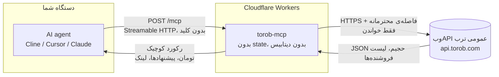

# ترب MCP - هوش مقایسه قیمت برای ایجنت‌ها


[](https://github.com/mmdju/torob-mcp/actions/workflows/verify.yml)


**دانش واقعی ترب برای ایجنت‌های هوش مصنوعی.** جستجو تو **موتور مقایسه قیمت ایران** با هر MCP کلاینتی (Cline، Cursor، Claude Desktop...): **قیمت به تومان**، قیمت همه‌ی فروشنده‌های یک محصول، تاریخچه قیمت، راهنمای خودِ ترب، پروفایل فروشنده‌ها، پیشنهادهای ویژه‌ی امروز. **فقط خواندنیه، بدون کلید، بدون لاگین** - و جواب‌ها به‌جای اون صفحه‌ی ۷۰ کیلوبایتی، چند کیلوبایت بیشتر نیستن.

**آدرس زنده:** `https://torob-mcp.mmdju3.workers.dev/mcp` (Streamable HTTP، بدون state) - اگه همین آدرس رو بدون `/mcp` تو مرورگر باز کنی [سایت](https://torob-mcp.mmdju3.workers.dev/) رو می‌بینی، و `GET /mcp` صفحه‌ی راهنمای اتصال رو می‌ده به‌جای خطای JSON.

> [!IMPORTANT]
> **نسخهٔ میزبانی‌شده، نسخهٔ اصلی نیست - یه دموی تست سریعه.** روی کلادفلر اجرا می‌شه و ترب اون رو کلاینتِ دیتاسنتری می‌بینه، برای همین **محدودیت داره (۲۰ درخواست به `/mcp` در دقیقه به‌ازای هر IP)** و **هر چند وقت یک‌بار ترب موقتاً متوقفش می‌کنه**. برای استفادهٔ جدی، نسخهٔ اصلی رو روی سیستم خودت اجرا کن (پایین‌تر): نه محدودیتی از طرف ماست، نه درخواست‌ها از اتصال تو نیست. ببین [وضعیت](#وضعیت).

**[English version](README.md)** · **[مثال‌ها](examples/sample-calls.md)** · **[مرجع ابزارها](docs/tools.md)** · **[تغییرات](CHANGELOG.md)**

## اتصال در ۳۰ ثانیه

هر MCP کلاینتی، **فقط یه آدرس**. Cline / Cursor / Claude Desktop (استایل `mcp.json`):

```json
{
  "mcpServers": {
    "torob": { "url": "https://torob-mcp.mmdju3.workers.dev/mcp" }
  }
}
```

بعدش فقط حرف بزن: **«ارزون‌ترین آیفون ۱۳ کجاست؟»**، **«هدفون زیر ۱۰ میلیون»**، **«این گوشی رو کجا بخرم بهتره؟»**، **«چی تخفیف خورده؟»**.

دستت به کلاینت نمی‌رسه؟ کل پروتکل یه POST بیشتر نیست - یه فراخوانی واقعی:

```bash
curl -sS https://torob-mcp.mmdju3.workers.dev/mcp \
  -H 'content-type: application/json' \
  -H 'accept: application/json, text/event-stream' \
  -d '{"jsonrpc":"2.0","id":1,"method":"tools/call","params":{"name":"search_products","arguments":{"query":"هدفون بی سیم","limit":2}}}'
```

و جوابی که تو همون یه پیام برمی‌گرده، بُریده‌شده تا استخوان:

```json
{
  "query": "هدفون بی سیم",
  "total_matches": 412,
  "total_matches_note": "Torob's own count is approximate - it changes between identical requests - so page with has_next_page rather than trusting the number.",
  "price_range_toman": { "min": 98000, "max": 2500000 },
  "products": [
    {
      "prk": "prk-a1b2c3d4-0000-4000-8000-000000000001",
      "name_fa": "هدفون بی‌سیم مدل P47",
      "price_toman": 238970,
      "available": true,
      "shop_name": "فروشگاه لوازم دیجیتال",
      "url": "https://torob.com/p/prk-a1b2c3d4-0000-4000-8000-000000000001/",
      "details_url": "https://api.torob.com/v4/base-product/details/?search_id=s1&prk=prk-a1b2c3d4-0000-4000-8000-000000000001"
    },
    {
      "prk": "prk-a1b2c3d4-0000-4000-8000-000000000002",
      "name_fa": "هدفون بلوتوثی مدل P9",
      "price_toman": 410000,
      "available": true,
      "shop_name": "پخش عمومی صوت",
      "url": "https://torob.com/p/prk-a1b2c3d4-0000-4000-8000-000000000002/"
    }
  ],
  "attribution": "Data comes from Torob's public web API. Prices, stock and seller offers change constantly - always confirm on torob.com before buying."
}
```

کلاینت‌های MCP توی مرورگر هم کار می‌کنن - endpoint جواب preflight مرورگر (`OPTIONS /mcp`) رو می‌ده.

### یا لوکال، روی خودِ ماشینت اجراش کن

همون ۱۵ ابزار، ولی به‌عنوان یک **پروسهٔ محلی** — نه endpointِ ما، نه محدودیتِ نرخِ خودمون. هر چیزی که یه اجرا یاد می‌گیره می‌ره توی `~/.torob-mcp/state.json`: اسم و لینکِ محصولاتی که پیدا کرد، و دیواری که داره صبرش می‌کنه. ری‌استارت هر دو رو نگه می‌داره؛ پاک کردنِ اون فایل همه‌چیز رو از نو شروع می‌کنه.

یک خط — بار اول کُندتره چون npm می‌سازتش، و باید `git` نصب باشه، چون یکی از وابستگی‌ها (`fa-text-utils`) از یک مخزنِ گیت میاد:

```json
{
  "mcpServers": {
    "torob": { "command": "npx", "args": ["-y", "github:mmdju/torob-mcp"] }
  }
}
```

یا از یک کلون، اگه دوست داری کدی رو اجرا کنی که خودت می‌تونی بخونیش:

```bash
git clone https://github.com/mmdju/torob-mcp.git
cd torob-mcp && npm install      # اسکریپتِ prepare خودش dist/ رو می‌سازه
```

```json
{
  "mcpServers": {
    "torob": { "command": "node", "args": ["/path/to/torob-mcp/dist/index.js"] }
  }
}
```

## ۱۵ ابزار، دسته‌بندی‌شده بر اساس سؤال

**پیداش کن**

| ابزار | به چه دردی می‌خوره |
|---|---|
| `torob_suggest` | حرف مبهم به **عبارت‌هایی که خود ترب پیشنهاد می‌ده** |
| `search_products` | «اینو نشونم بده»، چک قیمت - **فیلتر، مرتب‌سازی، صفحه‌بندی، بازه قیمت** |
| `search_by_image` | «این چیه؟» - محصول‌های مشابه **یه لینک عکس**، بدون آپلود |
| `browse_categories` | پیمایش **درخت دسته‌بندی** ترب، با تعداد محصول هر دسته |
| `list_locations` | **آیدی استان و شهر**، به‌علاوه‌ی شهرهایی که کاربرهای ترب بیشتر انتخاب می‌کنن |

**یه محصول رو بشناس**

| ابزار | به چه دردی می‌خوره |
|---|---|
| `product_details` | یک محصول به‌علاوه‌ی **قیمت همه‌ی فروشنده‌ها** (آنلاین و **حضوری**)، با مشخصات فنی و کل بازه‌ی قیمت |
| `product_guide` | «اینو بخرم؟» — **نوشتهٔ خودِ ترب** دربارهٔ یک مدل: چیه، نقاط قوت و ضعفش چیه، خریدارها چی گفتن |
| `price_history` | «الان بخرم یا صبر کنم؟» - **نمودار قیمت خود ترب**، ماه‌به‌ماه، و اینکه آخرین بار کِی عوض شده |

**تصمیم بگیر**

| ابزار | به چه دردی می‌خوره |
|---|---|
| `similar_products` | «این گرون شد، پس چی بگیرم؟» |
| `compare_products` | «کدومشون؟» - **فقط چیزهایی که واقعاً فرق دارن**، به‌علاوه‌ی فاصله قیمت |
| `find_best_value` | «بهترین X زیر Y تومان» - **رتبه‌بندی بر اساس چیزی که بودجه‌ات واقعاً به آن می‌رسه** |

**فروشگاه‌ها و فروشنده‌ها**

| ابزار | به چه دردی می‌خوره |
|---|---|
| `shop_profile` | «این فروشنده قابل اعتماده؟» - **نکته‌های خود ترب**، نماد اعتماد، امتیاز، شرایط ارسال، و لیست کالاهاش |
| `find_shops` | پیدا کردن **فروشگاه** با اسم یا شهر، وقتی کاربر اسم یه فروشگاه رو می‌گه |

**داغِ الان**

| ابزار | به چه دردی می‌خوره |
|---|---|
| `torob_trends` | **مردم الان چی سرچ می‌کنن**، هر کدام با یک کالای نمونه |
| `special_offers` | **پیشنهادهای ویژه امروز**، جدا از فهرست فروشنده‌های هر محصول |

هر ۱۵ ابزار فقط خواندنیه (`readOnlyHint`) و هیچ کلید یا حسابی نمی‌خواد. اینجا هیچ‌چیزی نمی‌تونه سفارش بده، پیام بده یا با فروشگاه تماس بگیره.

### درست استفاده کردن

- **همه‌ی قیمت‌ها تومانن** (۱ تومان = ۱۰ ریال). قیمت، موجودی و درجه‌ی فروشگاه **مدام عوض می‌شه** - همیشه لینک محصول رو بده تا کاربر خودش چک کنه.
- **کارت سرچ یه قیمته - ارزون‌ترین پیشنهاد.** `product_details` اون callـیه که همه‌ی فروشنده‌ها رو لیست می‌کنه، و `price_spread_toman` بینشون دقیقاً همون چیزیه که دلیل وجود یه سایت مقایسه قیمته. فروشگاه‌های **حضوری** رو هم می‌ده، با تاریخِ آخرین تغییر هر قیمت - پس اگه قدیمیه بگو.
- **`url` یه کارت، صفحه‌ی فروشگاه توی torob.comه.** لینکِ دکمهٔ خرید یه ریدایرکت ردیابی‌شده‌ی `api.torob.comه` که جدا با `buy_url` میاد - `url` رو تو جواب نگه دار، `buy_url` رو فقط وقتی بده که کاربر داره کلیک می‌کنه.
- **`price_history` چکِ صداقتِ قیمته.** قیمت امروز رو با نمودار خود ترب مقایسه کن؛ اسم سری‌ها مال خود تربه، پس همون‌ها رو نقل کن و از خودت روند نساز.
- **`price_toman: null` یعنی موجود نیست**، هیچ‌وقت ۰ نیست، و **۰ هیچ‌وقت رایگان نیست**: «ناموجود» خود ترب میاد با `available: false`. و **`price_unreliable: true`** یعنی خود ترب می‌گه این قیمت قابل اعتماد نیست - هشدار رو منتقل کن، به‌عنوان پیشنهاد خوب معرفیش نکن.
- **درجه‌ی فروشگاه بدون تعداد رأی معنی نداره.** `shop_score: 5` با `shop_votes: 0` عادیه یعنی «هنوز رأیی نخورده»، نه «فروشگاه پنج‌ستاره».
- **نتیجه‌ی خالی ثابت نمی‌کنه محصول وجود نداره.** جواب با خودش `query_note` و `suggested_queries` ترب رو می‌آره - با یکی از اون‌ها دوباره امتحان کن، به‌جای اینکه به کاربر بگی موجود نیست.
- **فیلتر یا مقدار ناشناخته با فیلترهای واقعی رد می‌شه** (`available_filters` مقادیر مجاز هر گروه رو داره). ترب اون چیزی رو که نشناسه نادیده می‌گیره و **بدون فیلتر** جواب می‌ده - برای همینه که این سرور اول رد می‌کنه.
- **ترب به کلاینتی که تند صدا بزنه، به‌جای داده چالش رباتی می‌ده.** سرور صریح می‌گه چی شده، هیچ‌وقت حل یا دورش نمی‌کنه، و بقیه‌ی یه هجوم رو تا آخرِ مهلت نگه می‌داره. جزئیات تو [SECURITY.md](SECURITY.md).
- نتیجه‌ها **سقف دارن** (پیش‌فرض ۱۰؛ سقفِ خودِ هر ابزار توی [docs/tools.md](docs/tools.md)) برای حفظ کانتکست ایجنت، و فارسی موقع مقایسه‌ی اسم‌ها فولد می‌شه (ی/ک عربی، ارقام مخلوط، نیم‌فاصله) - خود کوئری بدون تغییر به ترب می‌ره.
- **[examples/sample-calls.md](examples/sample-calls.md)** یازده مکالمه‌ی آماده‌ی کپی-پیست داره، **[docs/tools.md](docs/tools.md)** همه‌ی پارامترها و اسلاگ فیلترها رو، و **[docs/card.d.ts](docs/card.d.ts)** تایپ خروجی‌ها رو.

## چطور کار می‌کنه

یه سؤال چطور به جواب تبدیل می‌شه. تو این مسیر هیچ داده‌ای از کاربر ذخیره نمی‌شه.



- **بدون state.** هر درخواست مستقلِ - بدون سشن، بدون اکانت، بدون چیزی که لازم باشه لاگین کنی.
- **فقط خواندنی.** هر ۱۵ ابزار `readOnlyHint` دارن. هیچ‌چیزی نمی‌تونه چیزی رو عوض یا پاک کنه یا سفارش بده.
- **پروجکشن می‌شه، پاس‌تیود نمی‌شه.** صفحه‌ی جستجوی ترب حدود ۷۰ کیلوبایت متادیتای رنک و آزمایشه؛ هر ابزار یه رکورد فشرده برمی‌گردونه، و لیست فروشنده‌ها یه آرایه‌ی واقعی `offers[]` میاد نه یه رشته‌ی تخت.
- **بدون داده‌ی کاربر.** تنها چیزی که می‌مونه یه کش کوتاه‌مدت و یه نقشه‌ی کوچیک از آیدی محصولاتیه که خودش داده.
- **فاصله‌گذاری از سرِ اجباره.** درخواست‌های بالادستی یکی‌یکی با فاصله‌ی ۱.۵ ثانیه اجرا می‌شن و یه چالش، یه دروازه‌ی مشترک رو برای کل سرور می‌بنده به‌جای طوفان ری‌تری.
- **API مستندنشده.** وب‌API عمومی ترب بدون اطلاع عوض می‌شه؛ برای همین همین [اسکریپت verify](scripts/verify-live.mjs) وجود داره.

## اعتماد، قابل راستی‌آزمایی

حرف منو قبول نکن - خودت سرور زنده رو چک کن:

```bash
node scripts/verify-live.mjs   # فقط Node.js ۱۸ می‌خواد، نصب لازم نداره
```

این اسکریپت endpoint واقعی رو همون‌طوری که یه کلاینت MCP می‌زنه می‌راند، و نسخه‌ای که سرویس زنده گزارش می‌ده رو با آخرین ریلیز همین ریپو مقایسه می‌کنه - یعنی یه دیپلوی عقب‌مونده نمی‌تونه بی‌صدا بمونه. همون اسکریپت **ساعتی تو CI** هم اجرا می‌شه ([](https://github.com/mmdju/torob-mcp/actions/workflows/verify.yml))، و **چالش رباتی گزارش می‌شه ولی ران رو قرمز نمی‌کنه** چون جواب ترب به یه کلاینت تنده، نه دیپلوی خراب. سلامتِ **کد** رو بجِ [Test](https://github.com/mmdju/torob-mcp/actions/workflows/test.yml/badge.svg) می‌گه که هر push اجرا می‌شه. مساری کامل، از جمله اینکه چرا آیدی محصول بالادستی آدرس نیست: [docs/architecture.md](docs/architecture.md). و کلاینت آماده: [examples/python.py](examples/python.py).

## خودت اجراش کن

```bash
npm install      # دو وابستگی زمان‌اجرا: SDK مک‌پی و یه کتابخانه‌ی کوچیک متن فارسی
npm test         # می‌سازه و بعد همه‌ی تست‌های مخزن رو اجرا می‌کنه
npm run dev      # همون Worker واقعی، روی دستگاه خودت
npm run probe    # همه‌ی endpointهای بالادستی که این سرور می‌خونه رو دوباره چک می‌کنه
```

هیچی برای تنظیم نیست: نه اکانت، نه کلید، نه دیتابیس، نه بایندینگ. با `npm run build && npx wrangler deploy` نسخه‌ی خودت روی اکانت Cloudflare خودت بالا می‌ره.

## وضعیت

**دو نسخه داریم، و اونی که باید استفاده کنی نسخهٔ روی سیستم خودته.**

- **نسخهٔ اصلی** همین ریپوئه که خودت اجراش می‌کنی: `npx -y github:mmdju/torob-mcp` یا یه کلون و `node dist/index.js`. **هیچ محدودیتی از طرف ما نداره** و درخواست‌هاش از اتصال خودت می‌ره.
- **نسخهٔ تستی سریع** برای یه نگاه اول روی `https://torob-mcp.mmdju3.workers.dev/mcp` میزبانی شده — رایگان، فقط خواندنی و بدون کلید، حداکثر **۲۰ درخواست به `/mcp` در دقیقه به‌ازای هر IP** (بیشتر از حد → ۴۲۹ با `retry-after`)، و **هر چند وقت یک‌بار ترب موقتاً متوقفش می‌کنه**. هر دو توقف، همین موضوع رو تو متن خودشون می‌گن و آدرس نسخهٔ اصلی رو می‌دن، تا کسی فکر نکنه ابزارها خرابن.

چرا متوقف می‌شه؟ اندازه‌گیری ۲۰۲۶-۱۰-۰۹: **چیزی که ترب چالش می‌ده اتصاله، نه محتوای درخواست** - از یه اتصال معمولی همه‌ی شکل‌های درخواست جواب گرفت، ولی از شبکهٔ Cloudflare همون درخواست‌ها روی سومین درخواست به صفحهٔ چالش خوردن (زیردرخواست‌های Worker هدرِ `Cf-Worker` خود Cloudflare رو همراه دارن که حذف‌شدنی نیست). اگه نسخهٔ خودت هم مدام چالش خورد، لوکال اجراش کن یا `TOROB_API_BASE` رو به یه رلهٔ خودت بده: همه‌ی درخواست‌های بالادست و همه‌ی `details_url`هایی که می‌ده از اون رد می‌شن. اندازه‌گیری پشتِ این حرف‌ها توی [تغییرات](CHANGELOG.md) و رفتارش توی [SECURITY.md](SECURITY.md) هست.

## منبع داده

وب‌API عمومی ترب (**مستند نیست، بدون اطلاع قبلی عوض می‌شه**). این پروژه **وابسته به ترب نیست** و تأییدش رو نداره.

## لایسنس

پروانه MIT — ببین [LICENSE](LICENSE). نکته‌های امنیتی تو [SECURITY.md](SECURITY.md). نسخه‌ی انگلیسی تو [README.md](README.md).

*اگه به دردت خورد، یه ستاره بده تا بقیه‌ی سازنده‌ها هم پیداش کنن.*
