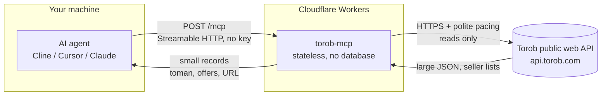

# Architecture

How a question becomes an answer. No user data is stored anywhere in this path.



What this means:

- **Stateless.** Every request stands alone - no sessions, no accounts, nothing to log in to.
- **Read-only.** All 15 tools carry `readOnlyHint`. Nothing here can change, delete or post anything, and no shop is ever contacted.
- **No storage.** The only memory is a short-lived response cache (minutes, per isolate, with a 12MB byte budget so one 1.4MB details payload cannot fill the isolate) and a small map of product ids this server handed out, so a `prk` can be resolved back to its seller list. A name and details URL learned from a search also travel through the per-colo Cache API, and the filter groups a query advertised are remembered for 30 minutes. Prices are re-read from Torob every time the cache expires.
- **Projected, not passed through.** A Torob search page is roughly 70KB of ranking metadata, experiment ids and ad plumbing. Every tool returns a compact record built by the server's projection layer instead.
- **Rate-limit aware.** Upstream calls are serialized with a gap, retried on transient failures with backoff, and abandoned fast on a hard failure - the MCP client usually times out before a long retry loop finishes. Torob does not throttle with a 429; a caller that goes too fast gets a bot challenge, handled below.
- **Metered on the hosted copy only.** `POST /mcp` on the deployed Worker allows 20 calls a minute per client IP and answers HTTP 429 with a `retry-after` past that, so the public service cannot be driven as an unmetered price API. The limiter is `src/rate-limit.ts`, imported by `src/worker.ts` alone: the server core has no such rule, and a self-hosted run is unlimited. The count lives in a Durable Object, one per client IP, so it is exact and the same in every colo; a per-colo cache stands in only if the binding is ever missing.
- **Challenges are not evaded.** Torob's edge answers some clients with a bot challenge. This server reads the JSON API only and never solves a challenge; a challenged response is reported as a clear, actionable error instead of being parsed into an empty result.

## The two-hop product path

Torob does not expose a product-by-id endpoint. A product id alone is **not** an address upstream - feeding a search result's id back as a search query returns nothing, because the search endpoint matches names, not ids.

What works is the `more_info_url` each search row carries: a ready-made absolute details URL that already contains the `search_id` needed to open the product. So:

1. `search_products` returns cards - each carrying its `details_url` - and remembers each row's details URL against its `prk`.
2. `product_details(prk, details_url)` opens the product with no lookup at all: the URL the caller echoes back carries what the endpoint needs, which is the only path that works on an isolate that never saw the search. It is asked for before anything is remembered (a remembered address can outlive the `search_id` inside it), and a URL that names a **different** product than the `prk` is refused instead of opened - the `prk` is what the question is about, and answering about one product with another's page is a wrong price.
3. Without the URL, the server falls back to what it remembers (in-process map, then the per-colo cache), then to searching by the product's **name** and matching the id again.
4. Last, it tries the details endpoint with the id alone. Whatever answered, `resolved_by` says which path it was - `remembered`, `details-url`, `exact-id`, `name-search` or `id-only` - so a name match is never presented as the exact id.

The seller list - the reason a Torob MCP exists - lives at `products_info.result[]` upstream ("فروشنده‌ها"). It is projected into a first-class `offers[]` array, not flattened into a string. The same response also carries the **in-person** shops (`products_in_store_info`, "فروشگاه‌های حضوری"), the spec tables and the variant tabs, so those reach the caller with no extra upstream request; only their size is capped by the projection.

The price tools are one hop each, keyed by the same `prk`: Torob's chart (`/v4/base-product/price-chart/`, monthly points, two labelled series), its change feed (`/v4/base-product/price-history/`) and the timestamp of its last price update (`/v4/base-product/last-modified-date/`). Each is cached (six hours for the chart, thirty minutes for the others) because a monthly series does not move faster than that. Two upstream families answer about shops rather than products: `/v4/internet-shop/details/` (the shop page's own data) and `/v4/internet-shop/list/` plus `/v4/internet-shop/base-product/list/` for the directory and a shop's catalogue. Image search takes an image URL rather than an upload (`/v4/base-product/search-by-image/`), so nothing a caller sends is stored, and the trending list is read from `/v4/search-trends/` on the same half-hour rhythm as its cache. `product_guide` is its own hop too: `/v4/base-product/wiki/` is Torob's write-up of one product - what it is, its strengths and weaknesses, what buyers said - turned into headings and text and cached for six hours, because an article does not move like a price. `product_details` reports `has_wiki`; this is the call that reads it.

## The bot wall, and what the server does about it

Torob's edge answers a client that calls too often with **HTTP 490** and an arCAPTCHA page where the JSON should be. This is not a 429 and not a redirect, and it does not clear on retry.

Two measurements exist. On 2026-09-24 a burst was enough to trip it and the block then cleared after about five idle minutes. Re-measured on 2026-10-03/04 the trigger is far lower - one or two requests following a long idle - and one block took about twenty-seven minutes to clear; a Cloudflare Worker and the dev machine were challenged in the same hour, so no egress is exempt. And it punishes exactly what a naive client does next: retry.

A third measurement, 2026-10-09, says what the decision is actually made on: **where the call comes from, not what it sends.** From an ordinary connection, five request shapes were all answered - the headers this server ships, a full Chrome header set, the site's own page cookies, and no cookies at all - and so were twelve searches 1.5s apart, which is this server's own cadence. From Cloudflare's network the same calls drew HTTP 490 with a 274KB arCAPTCHA page on the third request of the minute, and twelve calls from the machine beside it went through untouched in the same window. A Worker's subrequest also carries Cloudflare's own `Cf-Worker` header, naming the worker; a header of the same name set in the fetch options arrives beside it rather than replacing it, so it cannot be removed from inside the Worker.

The consequence is honest rather than clever: a hosted copy will be challenged from time to time, no matter what it sends, and there is no header to fix because nothing is misconfigured. So `TOROB_API_BASE` exists - set it and every upstream call, plus every `details_url` handed to a caller, goes through that base instead of `api.torob.com`. A relay on a connection Torob does not score as a bot is the only real cure; a deployment that stays on Cloudflare's egress keeps the gate, the pacing and the caching, and reports the wall when it arrives. The variable is read by both entry points (`src/index.ts` from the environment, `src/worker.ts` from the Worker's own variables) and a value that is not an absolute https URL stops the server with the reason rather than half-applying.

So the server treats a challenge as a cooldown, not a failure to retry:

- The first challenge is reported honestly. It is never retried - solving it is not this server's job, and hammering while it is up is how a temporary block becomes a permanent one.
- It closes a **gate**. The rest of the burst fails immediately with a "retry in N minutes" message and **spends no upstream request at all**, so the traffic that caused the challenge is not extended by the retries behind it.
- The gate is **shared through the store** (`src/store.ts`), not held by one isolate: another isolate in the same colo, or the next run of the local server, reads the same state instead of spending a fresh request to rediscover a wall that is still up.
- Two stages, because the two measurements differ by more than an order of magnitude: five minutes for the first challenge, thirty once a repeat has said the short one was not enough. The probe that discovers the long stage is spent once per stage rather than once per isolate.
- A real answer reopens the gate - only for a call that started after it shut, so a response already in flight cannot undo a fresh challenge.
- Upstream calls are serialized one at a time: a 1.5s gap, and the slot is held until the attempt finishes, so a parallel burst cannot overlap. A challenged response is never cached.

## Reading a response that answers 200

The projection layer exists because a well-formed response can still be wrong in a way that reads as an answer. These were found and fixed by live testing, not by reading code:

- **A product id is not an address upstream, and not a search term.** Handing a search result's `prk` back as a query returns nothing. The server remembers the details URL it handed out, and shares the product's name through the per-colo Cache API so a *different* isolate can still re-resolve it - but the card's `details_url` is the path that needs no memory at all, and a name match is reported as such rather than passed off as the same id.
- **A filter value is not a filter until upstream accepts it.** Torob ignores a slug or value it does not know and answers *unfiltered*, which reads as a filtered answer. Every search carries the filter groups it really accepts, with the values each takes, and a value outside that list is refused with the real ones.
- **Ids arrive as both numbers and strings.** Province and city ids are numeric; a string-only coercion dropped every row of a perfectly good response, and the tool reported "no provinces exist" while upstream had 30.
- **A field name guessed wrong returns an empty list, not an error.** `title` versus `name` on the location endpoints produced a clean `[]`. Every endpoint's shape was therefore verified against a live response before its tool shipped - and the projection now refuses the case outright: rows that exist and cannot be read raise an error, because only `results: []` means "there is nothing here".
- **The same list arrives more than once.** A live search sent 18 filter groups where 12 were unique: `brand`, `usage`, `type`, `bluetooth_version`, `shop_type` and `stock_status` each came twice, byte for byte, because upstream splits them across `filters1`, `filters2` and `attributes`. One group per slug survives now, which took `available_filters` from 4.5KB to 2.6KB in that answer - and the sources are read together with the modern `available_filters` key upstream already sends, so a rename cannot quietly turn the surface into "no filters".
- **A field Torob fills in is worth more than a derived guess.** Availability was read from the price because the search row's `stock_status` is empty on every row measured - but the product page sends `availability` as a real boolean and `is_accessible` beside it, so those now win, and a product Torob has withdrawn is reported out of stock with the reason instead of being offered at its last known price.

## The local server

Everything above runs in two places. The hosted Worker (`src/worker.ts`) and the Node entry (`src/index.ts`) share `buildServer` and the same fifteen tools; the one difference that matters is **where what a run learns is kept**.

- `src/store.ts` is that place, behind a single interface. On Workers it is the Cache API, which is per-colo - so the colo whose egress Torob challenged carries that fact while another colo is not punished for it. On Node a backend is installed at startup by `src/store-node.ts`.
- The local backend writes `~/.torob-mcp/state.json`. `TOROB_MCP_HOME` moves the directory, `TOROB_MCP_STORE=off` turns the store off. It holds two things: a product's name and details URL, and the marker saying the wall is still up. Writes go through synchronously, because a lost write here is either an extra search or - worse - a fresh request spent rediscovering a wall that has not lifted.
- `src/store-node.ts` is imported by `src/index.ts` alone. The Worker bundles from `src/worker.ts`, so no `node:` import reaches it: `npx wrangler deploy --dry-run` followed by a search of the output for `node:` comes back empty.

```bash
node dist/index.js            # stdio - what an MCP client spawns
node dist/index.js --http     # Streamable HTTP on :3000/mcp
```

Or `npx -y github:mmdju/torob-mcp`, which builds through the `prepare` script on a checkout that has no `dist/` yet.

## Verify it yourself

`node scripts/verify-live.mjs` (needs Node.js 18+, nothing to install).

It drives the real endpoint the way an MCP client does, and calls every tool in the list. It paces its calls - Torob challenges a burst, so a check that hammers every tool in a second is testing the wrong thing - and reports a challenge as the finding it is **without failing the run**: the wall is upstream's answer to a fast caller, not a broken deployment. Pass a gap in seconds to slow it further: `node scripts/verify-live.mjs 5`, or `node scripts/verify-live.mjs <url> 5` to point it elsewhere.

The hosted copy has its own limit - twenty `/mcp` calls a minute per client - and that budget belongs to the address, which a scheduled runner shares with other jobs. A 429 is therefore waited out (the window the response names, three attempts) instead of being read as a broken endpoint; only a limit that outlasts the wait fails the run.

A red badge on the [Test workflow](../.github/workflows/test.yml) means the code failed its own suite. The scheduled [Live verify](../.github/workflows/verify.yml) badge means the endpoint stopped answering its contract - health, version, landing, handshake, tool list - **or** that Torob renamed something a live check reads, since those checks fail the run too. A challenge is the one live failure that never reddens it.

`node scripts/verify-pack.mjs` is the packaging half of the same idea: it packs the project, installs the tarball into a throwaway project and drives the installed bin through a handshake, so a `files` list that forgot `dist/` fails as a broken package rather than as a silent one. It needs the network and git, so it is run by hand and is not part of `npm test`.

[examples/python.py](../examples/python.py) is a copy-paste client for the same endpoint.
