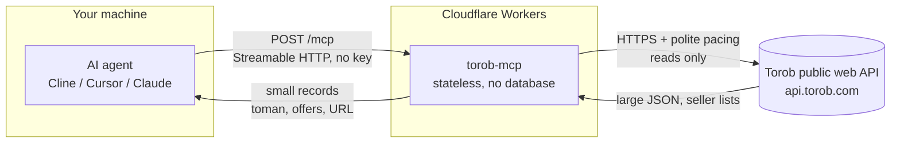

# Architecture

How a question becomes an answer. No user data is stored anywhere in this path.

What this means:

- **Stateless.** Every request stands alone - no sessions, no accounts, nothing to log in to.
- **Read-only.** All 9 tools carry `readOnlyHint`. Nothing here can change, delete or post anything, and no shop is ever contacted.
- **No storage.** The only memory is a short-lived response cache (minutes, per isolate, with a 12MB byte budget so one 1.4MB details payload cannot fill the isolate) and a small map of product ids this server handed out, so a `prk` can be resolved back to its seller list. A name and details URL learned from a search also travel through the per-colo Cache API, and the filter groups a query advertised are remembered for 30 minutes. Prices are re-read from Torob every time the cache expires.
- **Projected, not passed through.** A Torob search page is roughly 70KB of ranking metadata, experiment ids and ad plumbing. Every tool returns a compact record built by the server's projection layer instead.
- **Rate-limit aware.** Upstream calls are serialized with a gap, retried on transient failures with backoff, and abandoned fast on a hard failure - the MCP client usually times out before a long retry loop finishes. Torob does not throttle with a 429; a caller that goes too fast gets a bot challenge, handled below.
- **Challenges are not evaded.** Torob's edge answers some clients with a bot challenge. This server reads the JSON API only and never solves a challenge; a challenged response is reported as a clear, actionable error instead of being parsed into an empty result.

## The two-hop product path

Torob does not expose a product-by-id endpoint. A product id alone is **not** an address upstream - feeding a search result's id back as a search query returns nothing, because the search endpoint matches names, not ids.

What works is the `more_info_url` each search row carries: a ready-made absolute details URL that already contains the `search_id` needed to open the product. So:

1. `search_products` returns cards - each carrying its `details_url` - and remembers each row's details URL against its `prk`.
2. `product_details(prk, details_url)` opens the product with no lookup at all: the URL the caller echoes back carries what the endpoint needs, which is the only path that works on an isolate that never saw the search.
3. Without the URL, the server falls back to what it remembers (in-process map, then the per-colo cache), then to searching by the product's **name** and matching the id again.
4. Last, it tries the details endpoint with the id alone. Whatever answered, `resolved_by` says which path it was - `remembered`, `details-url`, `exact-id`, `name-search` or `id-only` - so a name match is never presented as the exact id.

The seller list - the reason a Torob MCP exists - lives at `products_info.result[]` upstream ("فروشنده‌ها"). It is projected into a first-class `offers[]` array, not flattened into a string.

## The bot wall, and what the server does about it

Torob's edge answers a client that calls too often with **HTTP 490** and an arCAPTCHA page where the JSON should be. This is not a 429 and not a redirect, and it does not clear on retry.

Two things were measured. A Worker's own egress is not challenged, so a normally-paced server answers fine - but a burst is enough to trip it, and then the block persists for roughly five idle minutes. And it punishes exactly what a naive client does next: retry.

So the server treats a challenge as a cooldown, not a failure to retry:

- The first challenge is reported honestly. It is never retried - solving it is not this server's job, and hammering while it is up is how a temporary block becomes a permanent one.
- It opens a **circuit breaker** for that isolate. The rest of the burst fails immediately with a "retry in N minutes" message and **spends no upstream request at all**, so the traffic that caused the challenge is not extended by the retries behind it.
- The breaker is per-isolate and expires on its own. A fresh isolate gets a clean chance rather than inheriting someone else's cooldown.
- Upstream calls are serialized with a 1.5s gap, and a challenged response is never cached.

## Reading a response that answers 200

The projection layer exists because a well-formed response can still be wrong in a way that reads as an answer. Three were found and fixed by live testing, not by reading code:

- **A product id is not an address upstream, and not a search term.** Handing a search result's `prk` back as a query returns nothing. The server remembers the details URL it handed out, and shares the product's name through the per-colo Cache API so a *different* isolate can still re-resolve it - but the card's `details_url` is the path that needs no memory at all, and a name match is reported as such rather than passed off as the same id.
- **A filter value is not a filter until upstream accepts it.** Torob ignores a slug or value it does not know and answers *unfiltered*, which reads as a filtered answer. Every search carries the filter groups it really accepts, with the values each takes, and a value outside that list is refused with the real ones.
- **Ids arrive as both numbers and strings.** Province and city ids are numeric; a string-only coercion dropped every row of a perfectly good response, and the tool reported "no provinces exist" while upstream had 30.
- **A field name guessed wrong returns an empty list, not an error.** `title` versus `name` on the location endpoints produced a clean `[]`. Every endpoint's shape was therefore verified against a live response before its tool shipped.

## Verify it yourself

`node scripts/verify-live.mjs` (needs Node.js 18+, nothing to install).

It drives the real endpoint the way an MCP client does. It paces its calls - Torob challenges a burst, so a check that hammers every tool in a second is testing the wrong thing - and reports a challenge as the finding it is **without failing the run**: the wall is upstream's answer to a fast caller, not a broken deployment, and the endpoint checks that never touch Torob are the ones a red badge reports on. Pass a gap in seconds as the first argument to slow it down further (`node scripts/verify-live.mjs 5`).

[examples/python.py](../examples/python.py) is a copy-paste client for the same endpoint.
